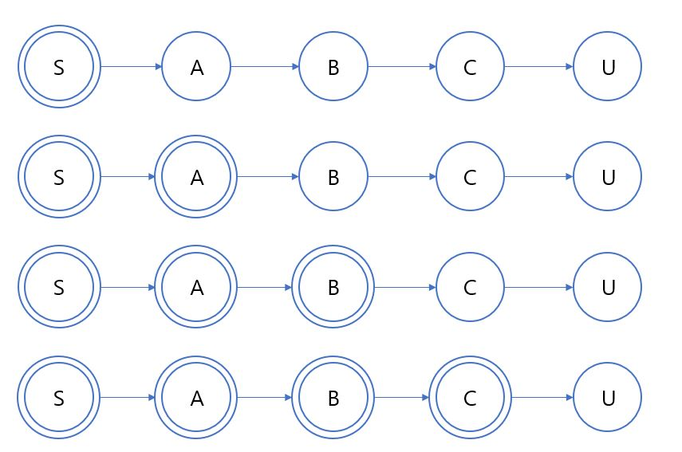

#  벨만-포드 알고리즘(Bellman - Ford)


### 최단 경로 문제

최단 경로 문제란 주어진 그래프에서 주어진 두 정점을 연결하는 가장 짧은 경로의 길이를 찾는 문제다.  

만약 가중치가 없는 그래프라면 이는 BFS로 풀이할 수 있다.

따라서 **가중치가 있는 그래프**의 문제를 다뤄볼 것이다.


#### 가중치의 양수와 음수

최단 경로 문제를 해결하려 할 때 가장 유의해야할 것은 음수 가중치를 갖는 간선이 있는지 여부이다. 

왜냐면 음수가 들어가면 당연히 경로의 길이(합)가 짧아지기 때문이다. 

또한, 음수가 등장하면 사이클이 발생할 수 있다. 만약 음수 사이클이 발생한다면 경로의 길이는 계속 줄어들 것이고 원하는 답을 얻지 못한다. 


#### 방향과 무방향

방향 그래프인지도 확인하는 것이 중요하다. 이는 음수 사이클과 관련이 있다. 

무방향(양방향이라고도 한다) 그래프는 노드 간 두 개의 방향 간선을 가졌다고 볼 수 있다.  

만약 양수 간선이라고 하면 최소 거리는 정해질 것이다. (더하면 더할수록 값은 증가하기 때문)

그러나 음수라면? 위와 같이 음수 사이클이 발생할 것이다. 

**따라서 음수 가중치가 있는 그래프라면 무조건 방향이 있어야 한다.**


#### 알고리즘 구분

흔히 최단 경로 문제에서는 3가지의 알고리즘이 사용된다.

1. 다익스트라(Djikstra) 알고리즘
   - 음수 가중치가 없는 그래프에서 단일 시작점부터 다른 모든 정점까지의 최단 거리
2. 벨만-포드 알고리즘
   - 음수 가중치가 있는 그래프에서 단일 시작점부터 다른 모든 정점까지의 최단 거리
   - 음수 사이클 판정
3. 플로이드 - 와샬(Floyd - Warshall) 알고리즘
   - 음수 가중치가 있지만 음수 사이클이 없는 그래프에서 모든 정점 쌍의 최단 거리


이제 벨만 - 포드 알고리즘을 알아보자.


### 원리

벨만-포드 알고리즘은 시작점에서 각 정점까지 가는 최단거리의 상한을 적당히 예측한 뒤 예측 값과 실제 최단 거리 사이의 오차를 반복적으로 줄여가는 방식으로 동작한다. 


벨만 포드 알고리즘은 완화(Relaxation)라는 과정을 거친다.

시작점이 S라 하자. 

먼저 시작점에서 시작점까지의 최단 거리는 당연히 0이다. 따라서 dist[S] = 0이다.

나머지 정점은 아직 거리를 모르기에 무한대로 초기화를 해준다. 

벨만 포드 알고리즘은 실제 최단 거리에 가깝게 갱신하기 위해 최단 거리의 특성을 이용한다.


특성이란

> 시작점에서 u와 v까지의 최단 거리를 dist[u], dist[v]라 하면
>
> dist[v] <= dist[u] + w(u,v) 	(w(u,v)는 u와 v의 간선의 가중치)
>
> 이라는 조건은 항상 참이다.


그래서 만약 dist[v] > dist[u] + w(u,v)일 경우

u까지 가는 최단 거리는 항상 dist[u]이거나 작으므로 dist[v] = dist[u] + w(u,v)라고 할 수 있다.

이러한 과정을 완화한다고 정의한다.

벨만 포드 알고리즘은 완화 과정을 모든 간선에 대해 반복적으로 실행한다. 완화가 성공할 때마다 dist는 줄어들고 최단 거리에 가까워지기 때문이다.


### 증명

그렇다면 총 몇 번을 해야 완성이 되는 것일까? 

또한 음수 사이클은 어떻게 배제할 것인가?





시작점 S에서 어떤 정점 U까지의 최단 경로가 위와 같이 S -> A -> B -> C -> U라고 하자.

dist[N]이 실제 최단 거리와 같음이 보장된 정점은 동심원으로 표기한다. 

처음에는 dist[S] = 0이므로 S만 동심원 표시를 했다.


1. 모든 간선을 순회하면서 한 번씩 완화를 시도하면 (S, A)에 대한 완화도 이루어진다. 

2. 따라서 dist[A] <= dist[S] + w(S,A)가 된다. dist[S] = 0이므로 dist[A] <=w(S,A)가 된다. 

3. 그런데 w(S,A)는 S에서 A까지 가는 최단 거리여야 한다. 이것보다 짧다면  애초에 S -> A -> B -> C -> U가 최단 경로일 수 없기 때문이다.

4. 따라서 dist[A] =  w(S, A)가 된다. 

위의 과정을 이해했는가? 그렇다면 이것을 4번 반복하면 된다. 

이것을 일반화하면 모든 간선에 대해 완화를 시도하는 작업을 x번 반복하면 x개 이하의 간선을 사용하는 최단 경로들은 전부 찾을 수 있다. 


**그렇다면 몇 번이나 반복해야 할까?**

최단 경로이며 음수 사이클이 없다면 당연히 한 정점을 두 번 지나는 일은 없을 겁니다.

따라서 간선 수는 총 정점의 개수인 V개에서 1를 뺀 V-1이라고 할 수 있고 

모든 간선에 대한 완화 과정은 전체 V-1번이다. 


**음수 사이클 판정**

만약 음수 사이클이 존재한다면 어디선가 계속 정점 방문을 반복하고 있을 것이다. 

위에서 말했듯이 완화과정은 전체 V-1번만 가능하다. 

완화과정이 V번째도 성공한다면? 이는 음수 사이클이 있다는 것이다. 


### 소스코드

```cpp
typedef pair<int, int> pi;
// 정점의 개수
int V;

vector<pi> adj[MAX_V];

vector<int> bellmanFord(int start){
    vector<int> dist(V,INF);
    dist[start] = 0;
    // ㅇ
    bool updated;
    
    for(int it = 0; it < V; it++){
        updated = false;
        for(int here = 0; here < V; here++){
            for(int i=0; i < adj[here].size(); i++){
                int there = adj[here][i].first;
                int cost = adj[here][i].second;
                // 완화 시도
                if(dist[there] > dist[here] + cost){
                    // 성공
                    dist[there] = dist[here] + cost;
                    updated = true;
                }
            }
        }
        // 모든 간선에 대해 완화 실패시 이미 최단거리이므로 종료
        if(!updated) break;
    }
    // V번했는데도 완화 성공하면 빈 배열 반환
    if(updated) dist.clear();
    return dist;
}
```


### 시간복잡도

모든 간선에 대한 완화과정이므로 간선의 수 E만큼 반복

완화과정을 총 V번 실행하므로 

최종 시간 복잡도는 O(VE)이다. 


### REFERENCE


[HY38's IT Blog -  Djikstra](https://hy38.github.io/why-dijkstra-fail-on-a-negative-weighted-edge)

[Youtube - T Academy - 벨만 포드 알고리즘](https://www.youtube.com/watch?v=PIT-aYPPPIQ)

