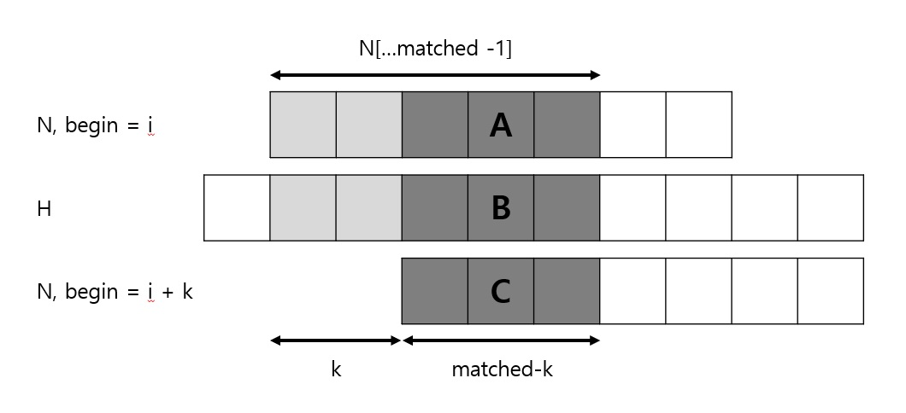
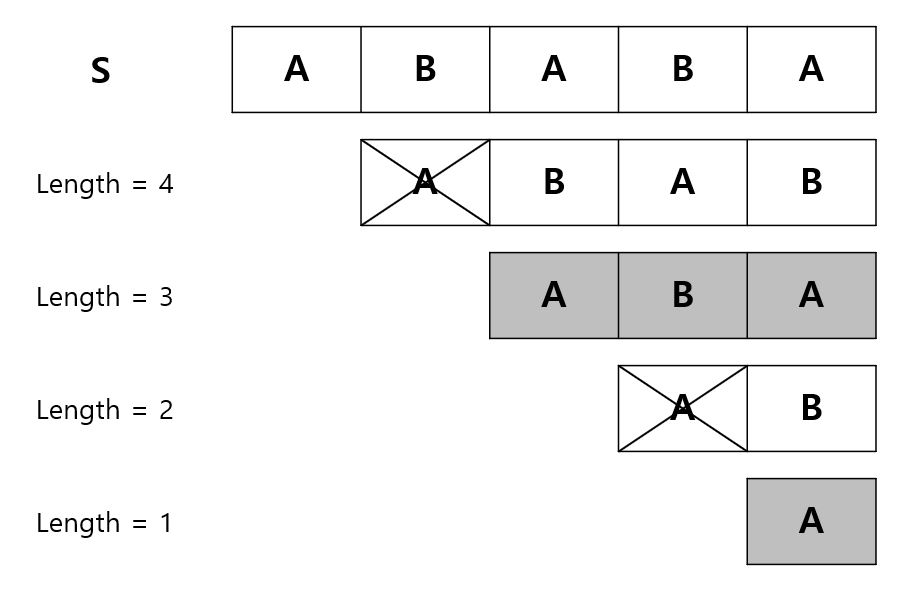
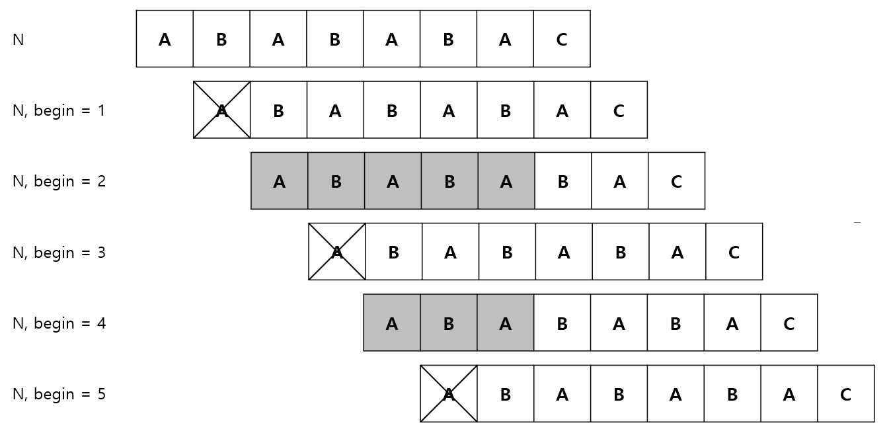

# KMP

KMP 알고리즘은 문자열 검색 문제를 효율적으로 해결할 수 있는 알고리즘이다.

**문자열 검색 문제란?**

- 주어진 문자열 H에서 문자열 N을 부분 문자열로 포함하는지 확인하고, N과 일치하는 부분 문자열의 시작 위치를 찾는 문제

<br/>

### Expression

- 문자열 S의 길이는 |S|로 표기
- S의 i번 글자는 S[i]로 표기
- 문자열 S의 i번 글자부터 j번 글자까지는 S의 부분 문자열이며 S[i..j]로 표기
- S의 0 to i번째 글자인 접두사는 S[..i] , 접미사는 S[i..]로 표기

<br/>

### 단순한 문자열 검색

"ABABC"에서 "AB"를 찾는 경우를 생각해보자.

| A     | B     | A     | B     | C    |
| ----- | ----- | ----- | ----- | ---- |
| **A** | **B** |       |       |      |
|       | A     | B     |       |      |
|       |       | **A** | **B** |      |
|       |       |       | A     | B    |

위와 같이 찾는 경우다. 소스코드를 보자.

```cpp
vector<int> search(const string& H, const string& N){
    vector<int> ret;
    // 모든 시작 위치를 확인
    for(int begin = 0; begin+N.size()<=H.size(); begin++){
        bool matched = true;
        for(int i=0;i<N.size();i++){
            if(H[begin+i] != N[i]){
                matched = false;
                break;
            }
        }
        if(matched) ret.push_back(begin);
    }
    return ret;
}
```

쉽게 생각할 수 있는 기본적인 알고리즘이다. 

그렇지만 문자열 H,N이 모두 a로만 구성되어 있는 긴 문자열인 최악의 상황을 가정한다면

시간 복잡도는 O(NH)가 될 것이다. 

구현이 단순하다는 장점이 있어 C++ string::find / Java indexOf() 등이 위와 같은 알고리즘을 사용한다.

<br/><br/>

### KMP 원리

만약 어떤 긴 문자열에서 N = "AABAABAC"를 찾는다고 가정하자.

시작 위치 i에서 N를 맞춰보니 첫 일곱 글자인 "AABAABA"까지는 일치하지만 8번째에서 불일치가 발생했다.

단순한 문자열 검색이라면 i+1번째 부터 새로 비교를 시작할 것이다. 

하지만 이미 **H[i..i+6] = "AABAABA"인 것을 알기에** **i+1번째부터 다시 검색하는 것은 비효율적**이다. 

사람의 눈으로 본다면 i+3번째, i+6번째 부터는 답이 될 가능성이 있다. 

그렇다면 이와 같이 매칭했던 결과를 저장하고 재사용 할 수 있을 것이다.

이와 같은 최적화를 적용한 문자열 검색 알고리즘이 KMP(Knuth-Morris-Pratt)알고리즘이다. 

<br/>

#### 다음 시작 찾기

kmp 알고리즘은 지금까지 일치한 글자의 수를 이용해 다음 시작 위치를 찾아낸다.

다음 그림은 H의 i번째 글자부터 비교하여 총 matched개의 글자가 일치하고 다음 글자가 불일치한 상황이다.

따라서 H[i..i+matched-1] 과 N[...matched-1]이 같다. 즉, A와 B는 같다.



불일치하므로 찾아보니 i+k (k<matched) 부터 가능하다고 가정하자.

그렇다면 가정에 의해 B와 C는 같다고 할 수 있다. 따라서 A = B = C가 되고 이는 N[...matched-1]의 접미사이자 접두사이기도 하다. 

다음 시작 위치가 i+k가 되기 위해서는 N[...matched-1]에서 길이가 matched-k인 접두사와 접미사를 찾아야 한다.

간단히 생각하면 N[...i]에서 접두사와 접미사가 둘 다 되는 가장 긴 문자열을 저장하고 사용하면 되는 것이다. 

KMP 알고리즘은 이런 전처리 과정에서 배열 pi를 계산한다.

> pi[i] = N[...i]의 접두사도 되고 접미사도 되는 문자열의 최대 길이.

N은 "aabaabac"일 때의 pi계산

| i    | N[...i]  | 접두사+접미사인 최대 문자열 | pi[i] |
| ---- | -------- | --------------------------- | ----- |
| 0    | a        | X                           | 0     |
| 1    | aa       | a                           | 1     |
| 2    | aab      | X                           | 0     |
| 3    | aaba     | a                           | 1     |
| 4    | aabaa    | aa                          | 2     |
| 5    | aabaab   | aab                         | 3     |
| 6    | aabaaba  | aaba                        | 4     |
| 7    | aabaabac | X                           | 0     |

위와 같은 테이블을 KMP 알고리즘에선 부분 일치 테이블 혹은 실패 함수라고 부른다. 

<br/>

이제 다음 시작 위치를 찾아보자.

다시 이전 그림을 보면 N[..matched-1]까지 일치하므로 이 문자열에서 접두사이자 접미사인 가장 긴 문자열의 길이를 구하면 k를 알 수 있다.


pi[matched-1]이 가장 긴 문자열이며 A,B,C이자 matched-k 라고 할 수 있다. ( **pi[matched-1] =  matched -k** )

**다음 위치까지의 증가량인 K는 matched - pi[matched-1]**이다. 

또한, 우리는 이미 pi[matched-1]만큼 문자열이 일치하는 것을 알고 있다. 그러므로 굳이 N[0]부터 비교할 필요가 없다. 

따라서 matched = pi[matched-1]이 되고 그 다음부터 비교하면 되는 것이다. 

```cpp

vector<int> kmpSearch(const string& H, const string& N){
    int n = H.size(), m = N.size();
    vector<int> ret; 	// N이 등장하는 시작 위치의 배열
    
    // 부분 일치 테이블 or 실패 함수 구하기.
    vector<int> pi = getPartialMatch(N);
    
    int begin = 0, matched = 0;
    while(begin + m <= n){
        // 문자열이 일치하면
        if(matched < m && H[begin+matched] == N[matched] ){
            matched++;
            // N이 완성되면
            if(matched == m)
                ret.push_back(begin);
        }
        // 문자열이 일치하지 않으면
        else{
            // 첫 문자열부터 다르면
            if(matched == 0)
                begin++;
            // 일치한 문자열이 있었다면
            else {
                begin += matched - pi[matched-1];
                matched = pi[matched-1];
            }
        }
    }
    return ret;
}
```

<br/>

#### 시간 복잡도 분석

while문에 따라 시간 복잡도는 다르지만 if문이 몇 번이나 수행되는 지를 통해 시간 복잡도를 분석한다.

**먼저 begin+ matched는 절대 감소하지 않는다.**

3가지 경우인데

- 문자열 일치 시 begin 변화량 0, matched ++;
- 문자열 불일치 시 matched == 0일경우 begin++;
- 문자열 불일치 시 matched가 0이 아닐 경우, begin+ matched라고 하자. 이 경우 begin의 변화량은 matched - pi[matched-1]이며 matched의 변화량은 +pi[matched -1] - matched이다. 즉, begin의 변화량 + matched의 변화량 = 0 이므로 감소하지 않는다.

따라서 문자 비교 성공은 문자열당 최대 한 번이므로 O(H)이다.

문자 비교가 실패도 역시 O(H)이므로 전체 시간 복잡도는 O(H)이다. 

<br/>

<br/>

### 부분 일치 테이블 구하기

KMP알고리즘은 구현했으니 이제 부분 일치 테이블만 만들면 사용할 수 있다.

<br/>

#### 간단한 방법 1

제일 간단한 건 역시 완전 탐색이다. 

(1) N[....i]을 S라 하자. 

(2) S의 길이를 p라 할 때 길이가 p -1인 접두사, p-2인 접두사...1인 접두사를 사용하여 이것이 접미사인지 확인하면 된다.  

이 경우의 시간 복잡도를 분석해보자.

(1)번은 총 |N|번 진행한다.  O(N)이다.

(2)번은 S의 길이는 (1,2....N)이 되고 접두사/접미사 확인하는 경우 (1,2....N)번이 걸릴 것이다. 따라서 O(N^2)이다.

(1)번이 시행될 때마다 (2)번이 모두 시행되므로 최종 시간 복잡도는 O(N^3)이다. 



<br/>

#### 방법 2. 방법 1의 최적화 

방법 1의 (1),(2)번과 같이 길이를 나누지 않고 N에 대해서 N 자신을 비교하여 접두사와 접미사인지 확인한다. 

그림을 보며 이해하자. 




위와 같은 경우는 방법 1에서 S로 나누는 (1)번 단계가 없기에 시간 복잡도 O(N^2)으로 좀 더 효율적으로 부분 일치 테이블을 찾을 수 있다.

```cpp
vector<int> getPartialMatch(const string& N){
    int m = N.size();
    vector<int> pi(m,0);
    // 시작은 1부터
    for(int begin = 1; begin < m; begin++){
        for(int i= 0;i+begin < m; i++){
            if(N[i] != N[begin+i] )              
                break;
            // 길이가 begin+i인 문자열의 가장 긴 접두사이자 접미사인 문자열 길이
            pi[begin + i] = max(pi[begin + i], i+1); // i+1은 하나라도 일치했을 때의 0 방지.
        }
    }
    return pi;
}
```

<br/>

#### 방법 3. kmp 적용

방법 2에 kmp를 적용해 볼 수 있다.  좀 더 효율적이다.

```cpp
vector<int> getPartialMatch(const string& N){
    int m = N.size();
    vector<int> pi(m,0);
    
    //시작은 1부터, 0이면 N자체를 찾아버리니 안된다.
    int begin =1, matched = 0;
    while(begin+matched < m){
        if(N[begin+matched] == N[matched] ){
            matched++;
            pi[begin+matched-1] = matched;
        }
        else{
            if(matched == 0)
                begin++;
            else{
                begin += matched - pi[matched-1];
                matched = pi[matched-1];
            }
        }
    }
    return pi;
}
```

두 가지 포인트가 있다.

1. begin을 증가할 때 pi[matched-1]를 사용한다. 

   kmp는 pi배열을 구한다는 전제 하에 진행했지만, pi를 구하는 알고리즘에서 pi를 쓴다?는 게 이해가 안 갈 수 있다. 

   방법 2의 그림을 보면 일치된 부분(N[..matched-1])은 접두사이자 접미사이다. 따라서 N[..begin +matched]까지의 가장 긴 접두사 및 접미사의 길이는 matched라고 볼 수 있다.

   begin을 옮길 때는 이미 matched가 0이 아니기에 pi[matched-1]은 이미 계산되어 있는 값이다. 

2. 1번과 관련해서 pi는 최대 한 번만 변경된다. 따라서 max연산을 사용할 필요가 없다. 

<br/>

<br/>

### 시간 복잡도

실패 함수를 제외한 KMP 알고리즘의 시간 복잡도는 O(H)이다. 

실패 함수(부분 일치 테이블 구하는 함수) 역시 KMP 알고리즘을 이용했기에 시간 복잡도는 O(N)이다. 

따라서 총 시간 복잡도는 O(H+N)이라고 할 수 있다.

<br/>

<br/>

#### 관련 문제 링크

[백준 1786번 찾기](https://www.acmicpc.net/problem/1786)

[백준 7575번 바이러스](https://www.acmicpc.net/problem/7575)

[백준 16916번 부분 문자열](https://www.acmicpc.net/problem/16916)


### REFERENCE

프로그래밍 대회에서 알고리즘 문제해결전략 2 - 20. 문자열 검색


