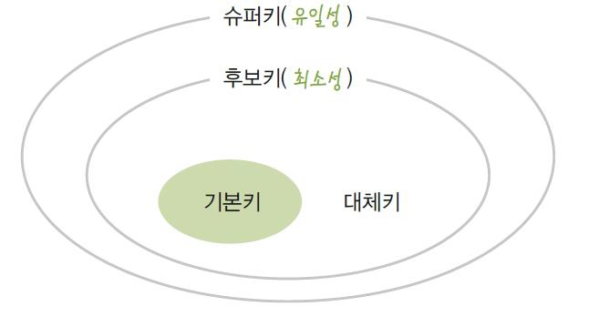

# Data Modeling

### 목차

[0. 모델링](#모델링)

[1. 데이터 모델링의 3단계 진행](#데이터-모델링의-3단계-진행)

[2. 데이터 독립성](#데이터독립성)

[3. 데이터 모델링 요소](#데이터-모델링-요소)

[4. ERD(Entity-Relationship Diagram)](#ERD(Entity-Relationship-Diagram))

[5. 엔티티(Entity)](#엔티티(Entity))

[6. 속성 (Attribute)](#속성-(Attribute))

[7. 관계(Relationship)](#관계(Relationship))

[8. 키(Key)](#키(Key))

[9. 관계 데이터 모델의 제약](#관계-데이터-모델의-제약)

[REFERENCE](#REFERENCE)

 

 

### 모델링

#### 모델링의 정의

데이터 모델은 데이터베이스의 골격을 이해하고 그 이해를 바탕으로 SQL문장을 기능과 성능적인 측면에서 효율적으로 작성하기 위해 꼭 알아야 하는 핵심요소이다. 

- 정보시스템을 구축하기 위해, 해당 업무에 어떤 데이터가 존재하는지 또는 업무가 필요로 하는 정보는 무엇인지를 분석하는 방법
- 기업 업무에 대한 종합적인 이해를 바탕으로 데이터에 존재하는 업무 규칙(Business Rule)에 대하여 참(True) 또는 거짓(False)을 판별할 수 있는 사실(사실명제)을 데이터에 접근하는 방법(How), 사람(Who), 전산화와는 별개의(독립적인) 관점에서 이를 명확하게 표현하는 추상화 기법

이것을 좀 더 실무적으로 해석해 보면 업무에서 필요로 하는 데이터를 시스템 구축 방법론에 의해 분석하고 설계하여 정보시스템을 구축하는 과정으로 정의할 수 있다. 

데이터 모델링을 하는 주요한 이유

-  업무정보를 구성하는 기초가 되는 정보들을 일정한 표기법에 의해 표현함으로써 정보시스템 구축의 대상이 되는 업무 내용을 정확하게 분석하는 것이다.
- 분석된 모델을 가지고 실제 데이터베이스를 생성하여 개발 및 데이터관리에 사용하기 위한 것이다. 즉, 데이터 모델링이라는 것은 단지 데이터베이스만을 구축하기 위한 용도로만 쓰이는 것이 아니라 데이터 모델링 자체로서 업무를 설명하고 분석하는 부분에도 매우 중요한 의미를 가지고 있다고 할 수 있다.

 

#### 모델링의 특징

모델링의 특징을 요약하면 추상화, 단순화, 명확화의 3대 특징으로 요약할 수 있다.

1) 추상화(모형화, 가설적)는 현실세계를 일정한 형식에 맞추어 표현을 한다는 의미로 정리할 수 있다. 즉, 다양한 현상을 일정한 양식인 표기법에 의해 표현한다는 것이다. 

2) 단순화는 복잡한 현실세계를 약속된 규약에 의해 제한된 표기법이나 언어로 표현하여 쉽게 이해할 수 있도록 하는 개념을 의미한다. 

3) 명확화는 누구나 이해하기 쉽게 하기 위해 대상에 대한 애매모호함을 제거하고 정확(正確)하게 현상을 기술하는 것을 의미한다.

따라서 모델링을 다시 정의하면 ‘현실세계를 추상화, 단순화, 명확화하기 위해 일정한 표기법에 의해 표현하는 기법’으로 정리할 수 있다. 정보시스템 구축에서는 모델링을 계획/분석/설계 할 때 업무를 분석하고 설계하는데 이용하고 이후 구축/운영 단계에서는 변경과 관리의 목적으로 이용하게 된다.

 

#### 데이터 모델이 제공하는 기능

업무를 분석하는 관점에서 데이터 모델이 제공하는 기능은 다음과 같다.

- 시스템을 현재 또는 원하는 모습으로 가시화하도록 도와준다.
- 시스템의 구조와 행동을 명세화 할 수 있게 한다.
- 시스템을 구축하는 구조화된 틀을 제공한다.
- 시스템을 구축하는 과정에서 결정한 것을 문서화한다.
- 다양한 영역에 집중하기 위해 다른 영역의 세부 사항은 숨기는 다양한 관점을 제공한다.
- 특정 목표에 따라 구체화된 상세 수준의 표현방법을 제공한다.

 

#### 데이터 모델링의 중요성 및 유의점

데이터 모델링이 중요한 이유는 파급효과(Leverage), 복잡한 정보 요구사항의 간결한 표현(Conciseness), 데이터 품질(Data Quality)로 정리할 수 있다.

 

**파급효과(Leverage)**

데이터 구조의 변경에 따른 표준 영향 분석, 응용 변경 영향 분석 등 많은 영향 분석이 일어난다. 그 이후에 해당 분야의 실제적인 변경 작업이 발생하게 된다. 

이러한 이유로 인해 시스템 구축 작업 중에서 다른 어떤 설계 과정보다 데이터 설계가 더 중요하다고 볼 수 있다.

 

**복잡한 정보 요구사항의 간결한 표현(Conciseness)**

 데이터 모델은 시스템을 구축하는 많은 관련자들이 설계자의 생각대로 정보요구사항을 이해하고 이를 운용할 수 있는 애플리케이션을 개발하고 데이터 정합성을 유지할 수 있도록 하는 것이다. 이렇게 이상적으로 역할을 할 수 있는 모델이 갖추어야 할 가장 중요한 점은 정보 요구사항이 정확하고 간결하게 표현되어야 한다는 것이다.

  

**데이터 품질(Data Quality)**

데이터베이스에 담겨 있는 데이터는 기업의 중요한 자산이다. 

저장되어진 데이터가 그저 그런 데이터, 정확성이 떨어지는 데이터라고 한다면 어떨까? 

**이것은 일부 시스템의 기능이 잘못되어 수정하는 성격의 일이 아니다. 이것은 해당 데이터로 얻을 수 있었던 소중한 비즈니스의 기회를 상실할 수도 있는 문제이다.** 데이터 품질의 문제가 중요한 이유가 여기에 있다. 

데이터 품질의 문제가 야기되는 중대한 이유 중 하나가 바로 데이터 구조의 문제이다. 중복 데이터의 미정의, 데이터 구조의 비즈니스 정의의 불충분, 동일한 성격의 데이터를 통합하지 않고 분리함으로써의 나타나는 데이터 불일치 등의 데이터 구조의 문제로 인한 데이터 품질의 문제는 치유하기에 불가능한 경우가 대부분이다. 

 

데이터 모델링을 할 때 **유의점**은 다음과 같다.

- 중복(Duplication) 

- 비유연성(Inflexibility) 

데이터 모델을 어떻게 설계했느냐에 따라 사소한 업무변화에도 데이터 모델이 수시로 변경됨으로써 유지보수의 어려움을 가중시킬 수 있다. 데이터의 정의를 데이터의 사용 프로세스와 분리함으로써 데이터 모델링은 데이터 혹은 프로세스의 작은 변화가 애플리케이션과 데이터베이스에 중대한 변화를 일으킬 수 있는 가능성을 줄인다.

- 비일관성(Inconsistency) 

데이터의 중복이 없더라도 비일관성은 발생한다. 예를 들어 신용 상태에 대한 갱신 없이 고객의 납부 이력 정보를 갱신하는 것이다. 개발자가 다른 데이터와 모순된다는 고려 없이 일련의 데이터를 수정할 수 있기 때문이다. 데이터 모델링을 할 때 데이터와 데이터간 상호 연관 관계에 대한 명확한 정의는 이러한 위험을 사전에 예방할 수 있도록 해준다.

  

### 데이터 모델링의 3단계 진행

추상화 수준에 따라 개념적 데이터 모델, 논리적 데이터 모델, 물리적 데이터 모델로 정리할 수 있다.

처음 현실세계에서 추상화 수준이 높은 상위 수준을 형상화하기 위해 **개념적 데이터 모델링**을 전개한다. 개념적 데이터 모델은 추상화 수준이 높고 업무중심적이고 포괄적인 수준의 모델링을 진행한다. 

엔티티(Entity)중심의 상위 수준의 데이터 모델이 완성되면 업무의 구체적인 모습과 흐름에 따른 구체화된 업무중심의 데이터 모델을 만들어 내는데 이것을 **논리적인 데이터 모델링**이라고 한다. 

논리적인 데이터 모델링 이후 데이터베이스의 저장구조에 따른 테이블스페이스 등을 고려한 방식을 **물리적인 데이터 모델링**이라고 한다. 

이것을 요약하여 정리하면 [표 Ⅰ-1-1]과 같다.

 

**개념적 데이터 모델링(Conceptual Data Modeling)**

개념적 데이터베이스 설계(개념 데이터 모델링)는 조직, 사용자의 데이터 요구사항을 찾고 분석하는데서 시작한다. 이 과정은 어떠한 자료가 중요하며 또 어떠한 자료가 유지되어야 하는지를 결정하는 것도 포함한다. 이 단계에 있어서의 주요한 활동은 핵심 엔티티와 그들 간의 관계를 발견하고, 그것을 표현하기 위해서 엔티티-관계 다이어그램을 생성하는 것이다. 

엔티티-관계 다이어그램은 조직과 다양한 데이터베이스 사용자에게 어떠한 데이터가 중요한지 나타내기 위해서 사용된다.

 

개념 데이터 모델을 통해 조직의 데이터 요구를 공식화하는 것은 두 가지의 중요한 기능을 지원한다.

- 개념 데이터 모델은 **사용자와 시스템 개발자가 데이터 요구 사항을 발견하는 것을 지원**한다. 개념 데이터 모델은 추상적이다. 그렇기 때문에 그 모델은 상위의 문제에 대한 구조화를 쉽게 하며, 사용자와 개발자가 시스템 기능에 대해서 논의할 수 있는 기반을 형성한다. 

- 개념 데이터 모델은 **현 시스템이 어떻게 변형되어야 하는가를 이해하는데 유용**하다. 일반적으로 매우 간단하게 고립된(Stand Alone) 시스템도 추상적 모델링을 통해서 보다 쉽게 표현되고 설명된다.

 

**논리적 데이터 모델링(Logical Data Modeling)**

 논리 데이터 모델링은 데이터베이스 설계 프로세스의 Input으로써 비즈니스 정보의 논리적인 구조와 규칙을 명확하게 표현하는 기법 또는 과정이라 할 수 있다. 

 데이터 모델링 과정에서 가장 핵심이 되는 부분이 논리 데이터 모델링이라고 할 수 있다. 

 데이터 모델링이란 모델링 과정이 아닌 별도의 과정을 통해서 조사하고 결정한 사실을 단지 ERD라는 그림으로 그려내는 과정을 말하는 것이 아니다. 시스템 구축을 위해서 가장 먼저 시작할 기초적인 업무조사를 하는 **초기단계에서부터 인간이 결정해야 할 대부분의 사항을 모두 정의하는 시스템 설계의 전 과정을 지원**하는 ‘과정의 도구’라고 해야 할 것이다. 

 이 단계에서 수행하는 또 한가지 중요한 활동은 **정규화**이다. 

 정규화는 논리 데이터 모델 상세화 과정의 대표적인 활동으로, **논리 데이터 모델의 일관성을 확보하고 중복을 제거**하여 속성들이 가장 적절한 엔티티에 배치되도록 함으로써 보다 신뢰성있는 데이터구조를 얻는데 목적이 있다. 논리 데이터 모델의 상세화는 식별자 확정, 정규화, M:M 관계 해소, 참조 무결성 규칙 정의 등을 들 수 있으며, 추가적으로 이력 관리에 대한 전략을 정의하여 이를 논리 데이터 모델에 반영함으로써 데이터 모델링을 완료하게 된다.

 

**물리적 데이터 모델링(Physical Data Modeling)**

데이터베이스 설계 과정의 세 번째 단계인 **물리 데이터 모델링은 논리 데이터 모델이 데이터 저장소로서 어떻게 컴퓨터 하드웨어에 표현될 것인가**를 다룬다. 데이터가 물리적으로 컴퓨터에 어떻게 저장될 것인가에 대한 정의를 물리적 스키마라고 한다. **이 단계에서 결정되는 것은 테이블, 칼럼 등으로 표현되는 물리적인 저장구조와 사용될 저장 장치, 자료를 추출하기 위해 사용될 접근 방법 등**이 있다. 

 

 

### 데이터독립성

#### 데이터 독립성이란?

데이터 독립성이란 하위 스키마를 변경하더라도 상위 스키마가 영향을 받지 않는 특성을 뜻한다.

데이터베이스를 3단계 구조로 나누고 단계별로 스키마를 유지하며 스키마 사이의 대응 관계를 정의하면서 데이터 독립성을 실현할 수 있다.

 

#### 데이터독립성의 필요성

 일체적 구성에서 기능화된 구성의 가장 큰 목적은 상호간 영향에서 벗어나 개별 형식이 가지는 고유의 기능을 유지시키며 그 기능을 극대화하는 것이다. 

컴포넌트 기반의 모듈 구성도 각각이 고유한 기능을 가지면서 다른 기능을 가지고 있는 컴포넌트와 인터페이스를 가지게 하는 모습으로 정의할 수 있다. 

어떤 단위에 대해 독립적인 의미를 부여하고 그것을 효과적으로 구현하게 되면 자신이 가지는 고유한 특징을 명확하게 할 뿐만 아니라 **다른 기능의 변경으로부터 쉽게 변경되지 않고 자신의 고유한 기능을 가지고 기능을 제공**하는 장점을 가지게 된다. 

데이터독립성은 지속적으로 증가하는 유지보수 비용을 절감하고 데이터 복잡도를 낮추며 중복된 데이터를 줄이기 위한 목적이 있다. 또한 끊임없이 요구되는 사용자 요구사항에 대해 화면과 데이터베이스 간에 서로 독립성을 유지하기 위한 목적으로 데이터 독립성 개념이 출현했다고 할 수 있다.

데이터독립성은 미국 표준 협회(ANSI) 산하의 X3 위원회(컴퓨터 및 정보 처리)의 특별연구분과위원회에서 1978년에 DBMS와 그 인터페이스를 위해 제안한 ‘three-schema architecture’로 정의할 수 있다.

데이터독립성을 확보하게 되면 다음과 같은 효과를 얻을 수 있다.

- 각 View의 독립성을 유지하고 계층별 View에 영향을 주지 않고 변경이 가능하다.
- 단계별 Schema에 따라 데이터 정의어(DDL)와 데이터 조작어(DML)가 다름을 제공한다.

 

데이터독립성을 이해하기 위해서는 3단계로 표현된 ANSI 표준 모델을 살펴보면 되는데 특히 3단계인 구조, 독립성, 사상(Mapping) 3가지를 이해하면 된다.

 

#### 데이터베이스 3단계 구조

ANSI/SPARC의 3단계 구성의 데이터독립성 모델은 외부단계와 개념적 단계, 내부적 단계로 구성된 서로 간섭되지 않는 모델을 제시하고 있다.

데이터독립성의 3단계에서 외부단계는 사용자와 가까운 단계로 사용자 개개인이 보는 자료에 대한 관점과 관련이 있스키마 구조데이터 유형의 공통적인 사항을 처리하는 통합된 뷰를 스키마 구조로 디자인한 형태이다. 우리가 쉽게 이해??를 설계하는 도구?? 데이터가 물리적으로 저장된 방법에 대한 스키마 구조를 말한다. 다음에서 [그림 Ⅰ-1-6]의 3단계 구조의 상세 사항에 대해 각 구성별로 예를 들어 설명한다.

 

#### 데이터독립성 요소

데이터베이스 스키마 구조는 3단계로 구분되고 각각은 상호 독립적인 의미를 가지고 고유한 기능을 가진다. 데이터 모델링은 통합관점의 뷰를 가지고 있는 개념 스키마를 만들어가는 과정으로 이해할 수 있다.

 

#### 두 영역의 데이터독립성

이렇게 3단계로 개념이 분리되면서 각각의 영역에 대한 독립성을 지정하는 용어가 바로 논리적인 독립성과 물리적인 독립성이다.

즉, 논리적인 데이터독립성은 외부의 변경에도 개념스키마가 변하지 않는 특징을 가진다. 물론, 새로운 요건이 추가되거나 삭제될 경우 칼럼이 변형될 수 있지만 그러한 변화가 개별 화면이나 프로세스에 의해 변화된다기 보다는 전체 업무적인 요건을 고려하여 종합적으로 영향을 받음을 의미한다.

 

#### 사상(Mapping)

영어로 ‘Mapping’은 우리말로 ‘사상’이라고 번역되는데 이것은 상호 독립적인 개념을 연결시켜주는 다리를 뜻한다. 데이터독립성에서는 크게 2가지의 사상이 도출된다.

즉, 외부 화면이나 사용자에게 인터페이스하기 위한 스키마 구조는 전체가 통합된 개념적 스키마와 연결된다는 것이 논리적 사상이다. 또한 통합된 개념적 스키마 구조와 물리적으로 저장된 구조의 물리적인 테이블스페이스와 연결되는 구조가 물리적 사상이다. 데이터독립성을 보장하기 위해서는 사상을 하는 스크립트(DDL)를 DBA가 필요할 때마다 변경해 주어야 한다. 즉, 각 단계(외부, 개념적, 내부적)의 독립성을 보장하기 위해서 변경사항이 발생했을 때 DBA가 적절하게 작업을 해주기 때문에 독립성이 보장된다고도 할 수 있다.

 

 

### 데이터 모델링 요소

**데이터 모델링의 세 가지 요소**

데이터 모델링을 구성하는 중요한 개념 세 가지가 있는데 이것은 데이터 모델에 대한 이해의 근간이 되므로 반드시 기억할 필요가 있다.

1) 업무가 관여하는 어떤 것(Things) 

2) 어떤 것이 가지는 성격(Attributes) 

3) 업무가 관여하는 어떤 것 간의 관계(Relationships)

이 세 가지는 데이터 모델링을 완성해 가는 핵심 개념으로서 결국 엔티티, 속성, 관계로 인식되는 것이다. 사물이나 사건 등을 바라 볼 때 전체를 지칭하는 용어를 어떤 것(Things)이라 하고, 그 어떤 것이 가지는 세부적인 사항을 성격(Attributes)이라고 할 수 있다. 또한 각각의 어떤 것은 다른 어떤 것과 연관성을 가질 수 있는데 이것을 관계(Relationship)라고 표현한다. 이 세상의 모든 사람, 사물, 개념 등은 어떤 것, 어떤 것 간의 관계, 성격의 구분을 통해서 분류할 수 있다. 

바로 이러한 원리, 즉 자연계에 존재하는 모든 유형의 정보들을 세 가지 관점의 접근 방법을 통해 모델링을 진행하는 것이다.

하나씩 살펴보기 전에 이를 표기하는 ERD를 먼저 살펴보자.

모델링 요소를 먼저 보고 싶다면? [클릭](#데이터 모델링 요소(이어서))

 

 

### ERD(Entity-Relationship Diagram)

#### 데이터 모델 표기법

데이터 모델에 대한 표기법으로 1976년 피터첸(Peter Chen)이 Entity-relationship model(E-R Model)이라는 표기법을 만들었다. **엔티티를 사각형으로 표현하고 관계를 마름모, 속성을 타원형으로 표현하는 이 표기법**은 데이터 모델링에 대한 이론을 배울 때 많이 활용되고 있다. 데이터베이스 설계에 대해 우리나라 대학에서는 주로 이 Chen의 모델 표기법을 통해 배우고 있다. [표 Ⅰ-1-6]은 엔티티와 속성 그리고 관계에 대한 다양한 표기법을 설명한 것이다

표기법은 바커 표기법이든 IE 표기법이든 상호간에 기술적으로 전환이 가능하기 때문에 한 가지만 정확하게 알고 있어도 다른 표기법을 이해하는데 큰 어려움이 없을 것이다.

 

#### ERD(Entity Relationship Diagram) 표기법을 이용하여 모델링하는 방법

ERD는 각 업무분석에서 도출된 엔티티와 엔티티간의 관계를 이해하기 쉽게 도식화된 다이어그램으로 표시하는 방법으로서 실제 프로젝트에서는 도식화된 그림 정도로만 생각하지 않고 **해당 업무에서 데이터의 흐름과 프로세스와의 연관성을 이야기하는 데 가장 중요한 표기법이자 산출물**이다. 

데이터분석이 어느 정도 완료되면 즉 엔티티, 관계, 속성 등이 데이터사전이나 각종 산출물에 의해 분석된 상태에서 ERD를 그리는 것이 원래 이론적인 작업 방법이지만, 실제 프로젝트에서는 분석된 엔티티와 관계, 속성 정보가 바로 ERD에 표현되며 내부 프로젝트 인원이나 해당 업무고객과 대화할 때 핵심 업무산출물로 항상 이용된다.

ERD를 그리는 것은 물론 어떻게 그리든 업무에는 전혀 지장을 주지 않지만 일정한 규칙을 지정하여 그림으로써 **데이터 모델을 누구나 공통된 시각으로 파악할 수 있고 의사소통을 원활하게 하는 장점**이 있다.

여기에서 제시하는 방법은 가이드일 뿐이며 프로젝트 상황과 엔티티의 관련 순서에 따라 얼마든지 다르게 배치될 수 있음을 숙지하고 배치방법에 대한 원칙을 다음과 같이 설명한다. 

1) ERD 작업순서 ERD를 작성하는 작업순서는 다음과 같다.

① 엔티티를 그린다. 

② 엔티티를 적절하게 배치한다. 

③ 엔티티간 관계를 설정한다. 

④ 관계명을 기술한다. 

⑤ 관계의 참여도를 기술한다. 

⑥ 관계의 필수여부를 기술한다.

ERD는 엔티티와 엔티티 사이의 관계가 있는 정보를 나타내므로 두 개를 이용하여 작성하고, 이에 따라 Primary Key와 Foreign Key를 ERD 규칙에 따라 기술하도록 한다. 엔티티는 사각형으로 표기하여 기술한다.

2) 엔티티 배치 엔티티를 처음에 어디에 배치하는지는 데이터 모델링 툴을 사용하든 사용하지 않던 중요한 문제이다. 일반적으로 사람의 눈은 왼쪽에서 오른쪽, 위 쪽에서 아래쪽으로 이동하는 경향이 있다. 

따라서 데이터 모델링에서도 가장 중요한 엔티티를 왼쪽상단에 배치하고 이것을 중심으로 다른 엔티티를 나열하면서 전개하면 사람의 눈이 따라가기에 편리한 데이터 모델링을 전개할 수 있다. 해당 업무에서 가장 중요한 엔티티는 왼쪽 상단에서 조금 아래쪽 중앙에 배치하여 전체 엔티티와 어울릴 수 있도록 하면 향후 관계를 연결할 때 선이 꼬이지 않고 효과적으로 배치할 수 있게 된다.

[그림 Ⅰ-1-10]의 데이터 모델에서도 가장 중요한 엔티티인 고객과 주문을 왼쪽 상단에 배치하여 다른 엔티티를 연결하는 방식으로 엔티티를 배치하였다. 주문에 따라 출고가 이루어졌으므로 주문이 위에 출고가 아래에 위치해 있다. 두 번째 업무흐름에 중심이 되는 엔티티, 보통 업무 흐름에 있어서 중심이 되는 엔티티는 타 엔티티와 많은 관계를 가지고 있으므로 중앙에 배치하도록 한다. [그림 Ⅰ-1-10]에서는 주문, 출고, 주문목록, 출고목록이 업무의 중심엔티티에 해당한다. 세 번째는 업무를 진행하는 중심엔티티와 관계를 갖는 엔티티들은 중심에 배치된 엔티티를 주위에 배치하도록 한다. [그림 Ⅰ-1-10]에서는 창고, 고객, 사원, 재고가 이에 해당한다.

3) ERD 관계 분석서를 보고 서로 관련있는 엔티티간에 관계를 설정하도록 한다. 초기에는 모두 Primary Key로 속성이 상속되는 식별자 관계를 설정하도록 한다. 중복되는 관계가 발생되지 않도록 하고 Circle 관계도 발생하지 않도록 유의하여 작성하도록 한다.

4) ERD 관계명의 표시 관계설정이 완료되면 연결된 관계에 관계이름을 부여하도록 한다. 관계이름은 현재형을 사용하고 지나치게 포괄적인 용어(예, 이다, 가진다 등)는 사용하지 않도록 한다.

실제 프로젝트에서는 관계의 명칭을 크게 고려하지 않아도 무방하다. 왜냐하면 관계의 명칭이 나타나지 않아도 ERD의 흐름이 명확하게 드러나기 때문이다. 대부분의 관계는 엔티티의 성질과 주식별자를 보고 유추가 가능하다.

5) ERD 관계 관계차수와 선택성 표시 관계에 대한 이름을 모두 지정하였으면 관계가 참여하는 성격 중 엔티티내에 인스턴스들이 얼마나 관계에 참여하는 지를 나타내는 관계차수(Cardinality)를 표현한다. [그림 Ⅰ-1-13]은 관계의 관계차수를 지정한 ERD의 모습을 보여준다. 관계설명에서도 언급하겠지만 IE표기법으로는 하나(1, One)의 관계는 실선으로 표기하고 Barker표기법으로는 점선과 실선을 혼합하여 표기한다. 다수참여(Many)의 관계는 까마귀발과 같은 모양으로 그려준다. 또한 관계의 필수/선택표시는 관계선에 원을 표현하여 ERD를 그리도록 한다.

 

 

### 엔티티(Entity)

데이터 모델을 이해할 때 가장 명확하게 이해해야 하는 개념 중에 하나가 바로 엔티티(Entity)이다. 

- 엔티티는 사람, 장소, 물건, 사건, 개념 등의 명사에 해당한다.
- 엔티티는 업무상 관리가 필요한 관심사에 해당한다.
- 엔티티는 저장이 되기 위한 어떤 것(Thing)이다.

엔티티란 **업무에 필요하고 유용한 정보를 저장하고 관리하기 위한 집합적인 것(Thing)**으로 설명할 수 있다. 또는, 엔티티는 업무 활동상 지속적인 관심을 가지고 있어야 하는 대상으로서 그 대상들 간에 동질성을 지닌 인스턴스들이나 그들이 행하는 행위의 집합으로 정의할 수 있다. 

엔티티는 그 집합에 속하는 개체들의 특성을 설명할 수 있는 속성(Attribute)을 갖는데,

예를 들어 ‘학생’이라는 엔티티는 학번, 이름, 이수학점, 등록일자, 생일, 주소, 전화번호, 전공 등의 속성으로 특징지어질 수 있다. 이러한 속성 가운데에는 엔티티 인스턴스 전체가 공유할 수 있는 공통 속성도 있고, 엔티티 인스턴스 중 일부에만 해당하는 개별 속성도 있을 수 있다.

또한 **엔티티는 인스턴스의 집합**이라고 말할 수 있고, 반대로 **인스턴스라는 것은 엔티티의 하나의 값**에 해당한다고 정의할 수 있다. 

예를 들어 과목은 수학, 영어, 국어가 존재할 수 있는데 수학, 영어, 국어는 각각이 과목이라는 엔티티의 인스턴스들이라고 할 수 있다. 또한 사건이라는 엔티티에는 사건번호2010-001, 2010-002 등의 사건이 인스턴스가 될 수 있다. 

엔티티를 이해할 때 눈에 보이는(Tangible)한 것만 엔티티로 생각해서는 안되며 눈에 보이지 않는 개념 등에 대해서도 엔티티로서 인식을 할 수 있어야 한다. 실제 업무상에는 눈에 보이지 않는 것(Thing)이 엔티티로 도출되는 경우가 많기 때문에 더더욱 주의할 필요가 있다.

 

#### 엔티티와 인스턴스에 대한 내용과 표기법

엔티티를 표현하는 방법은 각각의 표기법에 따라 조금씩 차이는 있지만 대부분 사각형으로 표현된다. 다만 이 안에 표현되는 속성의 표현방법이 조금씩 다를 뿐이다. 엔티티와 엔티티간의 ERD를 그리면 [그림 Ⅰ-1-15]와 같이 표현할 수 있다.

[그림 Ⅰ-1-15]에서 과목, 강사, 사건은 엔티티에 해당하고 수학, 영어는 과목이라는 엔티티의 인스턴스이고 이춘식, 조시형은 강사라는 엔티티의 인스턴스이며 사건번호인 2010-001, 2010-002는 사건 엔티티에 대한 인스턴스에 해당한다.

 

#### 엔티티의 특징

엔티티는 다음과 같은 특징을 가지고 있으며 만약 도출된 엔티티가 다음의 성질을 만족하지 못하면 적절하지 않은 엔티티일 확률이 높다.

- 반드시 해당 업무에서 필요하고 관리하고자 하는 정보이어야 한다.(예. 환자, 토익의 응시횟수, …)

- **유일한 식별자**에 의해 식별이 가능해야 한다.
- 영속적으로 존재하는 인스턴스의 집합이어야 한다.(‘한 개’가 아니라 ‘두 개 이상’)

- 엔티티는 업무 프로세스에 의해 이용되어야 한다.

- 엔티티는 반드시 속성이 있어야 한다.

  - 속성을 포함하지 않고 엔티티의 이름만 가지고 있는 경우는 관계가 생략되어 있거나 업무 분석이 미진하여 속성정보가 누락되는 경우에 해당한다. 또한 주식별자만 존재하고 일반속성은 전혀 없는 경우도 마찬가지로 적절한 엔티티라고 할 수 없다. 단, 예외적으로 관계엔티티(Associative Entity)의 경우는 주식별자 속성만 가지고 있어도 엔티티로 인정한다.

- 엔티티는 다른 엔티티와 최소 한 개 이상의 관계가 있어야 한다.

   

#### 엔터티의 분류

엔터티는 엔터티 자신의 성격에 의해 실체유형에 따라 구분하거나 업무를 구성하는 모습에 따라 구분이 되는 발생시점에 의해 분류해 볼 수 있다.

**유무(有無)형에 따른 분류**

일반적으로 엔터티는 유무형에 따라 유형엔터티, 개념엔터티, 사건엔터티로 구분된다.

유형엔터티(Tangible Entity)는 **물리적인 형태가 있고 안정적이며 지속적으로 활용되는 엔터티**로 업무로부터 엔터티를 구분하기가 가장 용이하다. 예를 들면, 사원, 물품, 강사 등이 이에 해당된다. 

개념엔터티(Conceptual Entity)는 **물리적인 형태는 존재하지 않고 관리해야 할 개념적 정보로 구분이 되는 엔터티**로 조직, 보험상품 등이 이에 해당된다.

사건 엔터티(Event Entity)는 **업무를 수행함에 따라 발생되는 엔터티로서 비교적 발생량이 많으며 각종 통계자료에 이용**될 수 있다. 주문, 청구, 미납 등이 이에 해당된다.

 

**발생시점(發生時點)에 따른 분류**

엔터티의 발생시점에 따라 기본/키엔터티(Fundamental Entity, Key Entity), 중심엔터티(Main Entity), 행위엔터티(Active Entity)로 구분할 수 있다.

- 기본엔터티
  - 기본엔터티란 **그 업무에 원래 존재하는 정보로서 다른 엔터티와 관계에 의해 생성되지 않고 독립적으로 생성**이 가능하고 자신은 타 엔터티의 부모의 역할을 하게 된다. 다른 엔터티로부터 주식별자를 상속받지 않고 자신의 고유한 주식별자를 가지게 된다. 예를 들어 사원, 부서, 고객, 상품, 자재 등이 기본엔터티가 될 수 있다.

- 중심엔터티
  - 중심엔터티란 **기본엔터티로부터 발생되고 그 업무에 있어서 중심적인 역할**을 한다. 데이터의 양이 많이 발생되고 다른 엔터티와의 관계를 통해 많은 행위엔터티를 생성한다. 예를 들어 계약, 사고, 예금원장, 청구, 주문, 매출 등이 될 수 있다.

- 행위엔터티
  - 행위엔터티는 **두 개 이상의 부모엔터티로부터 발생되고 자주 내용이 바뀌거나 데이터량이 증가**된다. 분석초기 단계에서는 잘 나타나지 않으며 상세 설계단계나 프로세스와 상관모델링을 진행하면서 도출될 수 있다. 예를 들어 주문목록, 사원변경이력 등이 포함된다.

> 참고. 약한 개체
>
> "위크 엔티티"는 엔티티가 가진 애트리뷰트들만 가지고 고유하게 정의될 수 없는 엔티티를 말한다. 따라서 한 개 이상의 관계를 엔티티의 프라이머리 키로 삼아야 한다. 
>
> 위크 엔티티는 엔티티를 나타내는 사각형을 그리고, 관계를 나타내는 다이아몬드형을 그린 뒤, 그 둘을 굵은(bold) 선이나 이중(double)선으로 연결하여 표현한다. 
>
> 예를 들면, 업무 추적(work tracking) 데이터베이스에서는, 한 태스크(task)는 태스크를 할당받은 사람(person)을 이용하여 식별된다. 이때 사람(person)은 엔티티이고, 태스크(task)는 위크 엔티티가 된다.

 

**엔터티 분류 방법의 예**

[그림 Ⅰ-1-23]은 두 가지 엔터티 분류 방법에 대한 예를 나타낸 것이다.

이 밖에도 엔터티가 스스로 생성될 수 있는지 여부에 따라 독립엔터티인지 의존엔터티인지를 구분할 수도 있다.

 

#### 엔티티의 명명

엔티티를 명명하는 일반적인 기준

1. 가능하면 현업업무에서 사용하는 용어를 사용한다. 

2. 가능하면 약어를 사용하지 않는다. 

3. 단수명사를 사용한다. 

4. 모든 엔티티에서 유일하게 이름이 부여되어야 한다. 

5. 엔티티 생성의미대로 이름을 부여한다.
   - 다섯 번째 원칙인 “엔티티 생성의미대로 이름을 부여한다.”에 대해서는 적절하지 못한 엔티티명이 부여되는 경우가 빈번하게 발생한다. 
   - 예를 들어, 고객이 어떤 제품을 주문하면 이를 주문목록이라고도 할 수 있고 고객제품이라고 할 수 있다. 만약 고객제품이라고 하면 ‘고객이 주문한 제품’인지 아니면 ‘고객의 제품’인지 의미가 애매모호해질 수 있게 된다. 엔티티의 이름을 업무목적에 따라 생성되는 자연스러운 이름을 부여해야 하는데 이와 상관없이 임의로 이름을 부여하게 되면 프로젝트에서는 커뮤니케이션 오류로 인해 문제를 야기할 수 있게 된다.

  

### 속성 (Attribute)

#### 속성의 개념

데이터 모델링 관점에서 속성을 정의하자면, “**업무에서 필요로 하는 인스턴스로 관리하고자 하는 의미상 더 이상 분리되지 않는 최소의 데이터 단위**”로 정의할 수 있다. 업무상 관리하기 위한 최소의 의미 단위로 생각할 수 있고, 이것은 엔티티에서 한 분야를 담당하고 있다.

속성의 정의를 정리해 보면 다음과 같다.

- 업무에서 필요로 한다.
- 의미상 더 이상 분리되지 않는다.
- 엔티티를 설명하고 인스턴스의 구성요소가 된다.

 

#### 엔티티, 인스턴스와 속성, 속성값에 대한 내용과 표기법

**엔티티, 인스턴스, 속성, 속성값의 관계**

엔티티, 인스턴스, 속성, 속성값에 대한 관계를 분석하면 다음과 같은 결과를 얻을 수 있다.

- 한 개의 엔티티는 두 개 이상의 인스턴스의 집합이어야 한다.
- 한 개의 엔티티는 두 개 이상의 속성을 갖는다.
- 한 개의 속성은 한 개의 속성값을 갖는다.

속성은 엔티티에 속한 엔티티에 대한 자세하고 구체적인 정보를 나타내며 각각의 속성은 구체적인 값을 갖게 된다.

예를 들어 사원이라는 엔티티에는 홍길동이라는 사람(엔티티)이 있을 수 있다. 홍길동이라는 사람의 이름은 홍길동이고 주소는 서울시 강서구이며 생년월일 1967년 12월 31일이다. 여기에 이름, 주소, 생년월일과 같은 각각의 값을 대표하는 이름들을 속성이라 하고 홍길동, 서울시 강서구, 1967년 12월 31일과 같이 각각의 이름에 대한 구체적인 값을 속성 값(VALUE)이라고 한다.

  

#### 속성의 특징

속성은 다음과 같은 특징을 가지고 있으며 만약 도출된 속성이 다음의 성질을 만족하지 못하면 적절하지 않은 속성일 확률이 높다.

- 엔티티와 마찬가지로 반드시 해당 업무에서 필요하고 관리하고자 하는 정보이어야 한다. (예, 강사의 교재이름)
- 정규화 이론에 근간하여 정해진 주식별자에 함수적 종속성을 가져야 한다.
- 하나의 속성에는 한 개의 값만을 가진다. 하나의 속성에 여러 개의 값이 있는 다중값일 경우 별도의 엔티티를 이용하여 분리한다.

> 함수적 종속성이란?
>
> **함수 종속**(functional dependency)이란 데이터베이스의 릴레이션(relation)에서 두 개의 애트리뷰트(attribute) 집합 간 제약의 일종이다.
>
> 어떤 릴레이션 **R**에서, **X**와 **Y**를 각각 **R**의 애트리뷰트 집합의 부분 집합이라 하자. 애트리뷰트 **X**의 값 각각에 대해 시간에 관계없이 항상 애트리뷰트 **Y**의 값이 오직 하나만 연관되어 있을 때 **Y**는 **X**에 **함수 종속**이라 하고, **X** → **Y**라고 표기한다. 
>
> 다시 말해, **R** 내의 애트리뷰트의 집합 **X**와 역시 **R** 내에 있는 또 다른 애트리뷰트의 집합 **Y**에 대해, 각각의 **X** 값에 대해 최대 한 개의 **Y** 값에 연관되어 있을 때, 애트리뷰트의 집합 **X**를 **함수 결정**(to functionally determine)하다고 한다.
>
> **X**를 **결정자**(determinant set)이라 하고, **Y**를 **종속자**(dependent attribute)라고 한다.

 

#### 속성의 분류

**속성의 특성에 따른 분류**

- 기본속성(Basic Attribute)
  - 본 속성은 업무로부터 추출한 모든 속성이 여기에 해당하며 엔티티에 가장 일반적이고 많은 속성을 차지한다.
  - 코드성 데이터, 엔티티를 식별하기 위해 부여된 일련번호, 그리고 다른 속성을 계산하거나 영향을 받아 생성된 속성을 제외한 모든 속성은 기본속성이다. 
  - 주의해야 할 것은 업무로부터 분석한 속성이라도 이미 업무상 코드로 정의한 속성이 많다는 것이다. 이러한 경우도 속성의 값이 원래 속성을 나타내지 못하므로 기본속성이 되지 않는다.

- 설계속성(Designed Attribute)
  - 설계속성은 업무상 필요한 데이터 이외에 데이터 모델링을 위해, 업무를 규칙화하기 위해 속성을 새로 만들거나 변형하여 정의하는 속성이다. 
  - 대개 코드성 속성은 원래 속성을 업무상 필요에 의해 변형하여 만든 설계속성이고 일련번호와 같은 속성은 단일(Unique)한 식별자를 부여하기 위해 모델 상에서 새로 정의하는 설계속성이다.

- 파생속성(Derived Attribute)
  - 파생속성은 다른 속성에 영향을 받아 발생하는 속성으로서 보통 계산된 값들이 이에 해당된다. 다른 속성에 영향을 받기 때문에 프로세스 설계 시 데이터 정합성을 유지하기 위해 유의해야 할 점이 많으며 가급적 파생속성을 적게 정의하는 것이 좋다.

**파생속성은 그 속성이 가지고 있는 계산방법에 대해서 반드시 어떤 엔티티에 어떤 속성에 의해 영향을 받는지 정의가 되어야 한다.**
예를 들어 ‘이자’라는 속성이 존재한다고 하면 이자는 원금이 1,000원이고 예치기간이 5개월이며 이자율이 5.0%에서 계산되는 속성값이다. 그렇다면 이자는 원금이 1,000원에서 2,000원으로 변하여도 영향을 받고 예치기간이 5개월에서 7개월로 증가하여도 값이 변하며 이자율이 5.0%에서 6.0%로 되어도 이자속성이 가지는 값은 변할 것이다. 한 번 값이 변해도 또 다시 영향을 미치는 속성값의 조건이 변한다면 이자의 값은 지속적으로 변경될 것이다.

이와 같이 타 속성에 의해 지속적으로 영향을 받아 자신의 값이 변하는 성질을 가지고 있는 속성이 파생속성이다. 파생속성은 꼭 필요한 경우에만 정의하도록 하여 업무로직이 속성 내부에 숨지 않도록 하는 것이 좋다. 

 

**엔티티 구성방식에 따른 분류**

엔티티를 식별할 수 있는 속성을 **PK(Primary Key)속성,** 

다른 엔티티와의 관계에서 포함된 속성을 **FK(Foreign Key)속성,** 

엔티티에 포함되어 있고 PK, FK에 포함되지 않은 속성을 **일반속성**이라 한다.

또한 속성은 그 안에 **세부 의미를 쪼갤 수 있는지에 따라 단순형 혹은 복합형**으로 분류할 수 있다. 

예를 들면 주소 속성은 시, 구, 동, 번지 등과 같은 여러 세부 속성들로 구성될 수 있는데 이를 복합 속성(Composite Attribute)이라 한다. 또한 나이, 성별 등의 속성은 더 이상 다른 속성들로 구성될 수 없는 단순한 속성이므로 단순 속성(Simple Attribute)이라 한다.

일반적으로 **속성은 하나의 값을 가지고 있으나, 그 안에 동일한 성질의 여러 개의 값이 나타나는 경우**가 있다. 이 때 속성 하나에 한 개의 값을 가지는 경우를 **단일값(Single Value)**, 그리고 여러 개의 값을 가지는 경우를 **다중값(Multi Value) 속성**이라 한다. 

주민등록번호와 같은 속성은 반드시 하나의 값만 존재하므로 이 속성은 단일값 속성(Single-Valued Attribute)이라 하고, 어떤 사람의 전화번호와 같은 속성은 집, 휴대전화, 회사 전화번호와 같이 여러 개의 값을 가질 수 있다. 자동차의 색상 속성도 차 지붕, 차체, 외부의 색이 다를 수 있다. 이런 속성을 다중값 속성(Multi-Valued Attribute)이라 한다. 다중값 속성의 경우 하나의 엔티티에 포함될 수 없으므로 1차 정규화를 하거나, 아니면 별도의 엔티티를 만들어 관계로 연결해야 한다.

 

#### 도메인(Domain)

각 속성은 가질 수 있는 값의 범위가 있는데 이를 그 속성의 도메인(Domain)이라 한다. 각 속성은 도메인 이외의 값을 갖지 못한다. 

따라서 도메인을 좀더 이해하기 쉽게 정리하면, 엔티티 내에서 속성에 대한 데이터타입과 크기 그리고 제약사항을 지정하는 것이라 할 수 있다.

 

#### **속성의 명명(Naming)**

- 속성의 이름을 부여할 때는 현업에서 사용하는 이름을 부여하는 것이 가장 중요하다. 아무리 일반적인 용어라 할지라도 그 업무에서 사용되지 않으면 속성의 명칭으로 사용하지 않는 것이 좋다.
- 일반적으로는 서술식의 속성명은 사용하지 말아야 한다. 명사형을 이용하고 수식어가 많이 붙지 않도록 유의하여 작성한다. 수식어가 많으면 의미파악이 힘들고 상세 설계단계에서 물리속성으로 전환하는데 명확한 의미파악이 어렵게 된다. 소유격도 사용하지 않는다.
- 공용화되지 않은 업무에서 사용하지 않는 약어는 사용하지 않는 것이 좋다. 지나치게 약어를 많이 사용하면 업무분석자 내에서도 의사소통이 제약을 받으며 시스템을 운영할 때도 많은 불편을 초래할 수 있다.
- 가능하면 모든 속성의 이름은 유일하게 작성하는 것이 좋다. 물론 대량의 속성을 정의하는 경우 유일하게 작성하는 것이 어려울 수도 있지만 이렇게 하는 것이 나중에 데이터에 대한 흐름을 파악하고 데이터의 정합성을 유지하는데 큰 도움이 된다. 또한 반정규화(테이블통합, 분리, 칼럼의 중복 등)를 적용할 때 속성명의 충돌(Conflict)을 해결하여 안정적으로 반정규화를 적용할 수 있게 된다.

  

### 관계(Relationship)

#### 관계의 정의

“**엔티티의 인스턴스 사이의 논리적인 연관성으로서 존재의 형태로서나 행위로서 서로에게 연관성이 부여된 상태**”라고 할 수 있다. 

관계는 엔티티와 엔티티 간 연관성을 표현하기 때문에 엔티티의 정의에 따라 영향을 받기도 하고, 속성 정의 및 관계 정의에 따라서도 다양하게 변할 수 있다.

 

#### 관계의 표기법

관계에서는 표기법이 상당히 복잡하고 여러 가지 의미를 가지고 있다. 다음 3가지 개념과 함께 표기법을 이해할 필요가 있다.

- 관계명(Membership) : 관계의 이름
- 관계차수(Cardinality) : 1:1, 1:M, M:N
- 관계선택사양(Optionality) : 필수관계, 선택관계

 

**관계명(Membership)**

관계명은 엔티티가 관계에 참여하는 형태를 지칭한다. 각각의 관계는 두 개의 관계명을 가지고 있다. 또한 각각의 관계명에 의해 두 가지의 관점으로 표현될 수 있다.

엔티티에서 관계가 시작되는 편을 관계시작점(The Beginning)이라고 부르고 받는 편을 관계끝점(The End)이라고 부른다. 관계 시작점과 끝점 모두 관계이름을 가져야 하며 참여자의 관점에 따라 관계이름이 능동적(Active)이거나 수동적(Passive)으로 명명된다. 관계명은 다음과 같은 명명규칙에 따라 작성해야 한다.

- 애매한 동사를 피한다. 예를 들면 ‘관계된다’, ‘관련이 있다’, ‘이다’, ‘한다’ 등은 구체적이지 않아 어떤 행위가 있는지 또는 두 참여자간 어떤 상태가 존재하는지 파악할 수 없다.
- 현재형으로 표현한다. 예를 들면 ‘수강을 신청했다’, ‘강의를 할 것이다’라는 식으로 표현해서는 안된다. ‘수강 신청한다’, ‘강의를 한다’로 표현해야 한다.

 

**관계차수(Degree/Cardinality)**

**두 개의 엔티티간 관계에서 참여자의 수를 표현**하는 것을 관계차수(Cardinality)라고 한다. 

가장 일반적인 관계차수 표현방법은 **1:M, 1:1, M:N**이다. 가장 중요하게 고려해야 할 사항은 한 개의 관계가 존재하느냐 아니면 두 개 이상의 멤버쉽이 존재하는지를 파악하는 것이 중요하다.
관계차수를 표시하는 방법은 여러 가지 방법이 있지만 Crow’s Foot 모델에서는 선을 이용하여 표현한다. 한 개가 참여하는 경우는 실선을 그대로 유지하고 다수가 참여한 경우는(Many) 까마귀발과 같은 모양으로 그려준다.

 

1)**1:1(ONE TO ONE) 관계**를 표시하는 방법

관계에 참여하는 각각의 엔티티는 관계를 맺는 다른 엔티티의 엔티티에 대해 단지 하나의 관계만을 가지고 있다.

 

2) **1:M(ONE TO MANY) 관계**를 표시하는 방법

관계에 참여하는 각각의 엔티티는 관계를 맺는 다른 엔티티의 엔티티에 대해 하나나 그 이상의 수와 관계를 가지고 있다. 그러나 반대의 방향은 단지 하나만의 관계를 가지고 있다.

 

3) **M:M(MANY TO MANY) 관계**를 표시하는 방법

관계엔티티의 엔티티에 대해 하나나 그 이상의 수와 관계를 가지고 있다. 반대의 방향도 동일하게 관계에 참여하는 각각의 엔티티는 관계를 맺는 다른 엔티티의 엔티티에 대해 하나 또는 그 이상의 수와 관계를 가지고 있다. 이렇게 M:N 관계로 표현된 데이터 모델은 이후에 두 개의 주식별자를 상속받은 관계엔티티를 이용하여 3개의 엔티티로 구분하여 표현한다.

 

**관계선택사양(Optionality)**

참여하는 엔티티가 항상 참여하는지 아니면 참여할 수도 있는지를 나타내는 방법이 **필수 참여(Mandatory Membership)**와 **선택참여(Optional Membership)**이다.

**필수적 참여**

- 필수참여는 참여하는 **모든 참여자가 반드시 관계를 가지는, 타 엔티티의 참여자와 연결이 되어야 하는 관계**이다. 

- 모든 개체 인스턴스가 관계에 반드시 참여해야 하는 것을 의미한다.
- 예 ) 고객 개체가 책 개체와의 구매 관계에 필수적으로 참여 - 모든 고객은 책을 반드시 구매해야 함
- 예) 주문서는 반드시 주문목록을 가져야 하며 주문목록이 없는 주문서는 의미가 없으므로 주문서와 주문목록은 필수참여관계가 되는 것이다. 

 

**선택적 참여**

- 개체 인스턴스 중 일부만 관계에 참여해도 되는 것을 의미한다.
- 예 ) 책 개체가 고객 개체와의 구매 관계에 선택적으로 참여 - 고객이 구매하지 않은 책이 존재할 수 있음
- 예) 목록은 주문이 될 수도 있고 주문이 되지 않은 목록이 있을 수도 있으므로 목록과 주문목록과의 관계는 선택참여(Optional Membership)가 되는 것이다.

-  선택참여된 항목은 물리속성에서 Foreign Key로 연결될 경우 Null을 허용할 수 있는 항목이 된다. 만약 선택참여로 지정해야 할 관계를 필수참여로 잘못 지정하면 애플리케이션에서 데이터가 발생할 때 반드시 한 개의 트랜잭션으로 제어해야 하는 제약사항이 발생한다. 
- 그러므로 설계단계에서 필수참여와 선택참여는 개발시점에 업무 로직과 직접적으로 관련된 부분이므로 반드시 고려되어야 한다.

선택참여관계는 ERD에서 관계를 나타내는 선에서 선택참여하는 엔티티 쪽을 원으로 표시한다. 필수참여는 아무런 표시를 하지 않는다.
만약 관계가 표시된 양쪽 엔티티에 모두 선택참여가 표시된다면, 즉 0:0(Zero to Zero)의 관계가 된다면 그 관계는 잘못될 확률이 많으므로 관계설정이 잘못되었는지를 검토해 보아야 한다.

 

관계선택사양은 관계를 통한 상대방과의 업무적인 제약조건을 표현하는 것으로서 간단하면서 아주 중요한 표기법이다. 이것을 어떻게 설정했는지에 따라 참조무결성 제약조건의 규칙이 바뀌게 되므로 주의 깊게 모델링을 해야 한다.

 

### 키(Key)

#### 키의 정의

릴레이션에서 투플들을 유일하게 구별하는 속성 또는 속성들의 집합

 

#### 키의 특성

유일성 (uniqueness)

- 하나의 릴레이션에서 모든 투플은 서로 다른 키 값을 가져야 함

최소성 (minimality)

- 꼭 필요한 최소한의 속성들로만 키를 구성

 

#### 키의 종류

| 고객 아이디 | 고객이름 | 주소                           | 적립금 | 등급   |
| ----------- | -------- | ------------------------------ | ------ | ------ |
| sinchon     | 홍길동   | 서울특별시 서대문구 연세로 8-1 | 1000   | 정회원 |
| seoul       | 김영희   | 서울특별시 관악구 관악로 165   | 2000   | 준회원 |
| hanyang     | 이철수   | 서울특별시 성동구 왕십리로 223 | 1000   | 준회원 |

**고객 릴레이션**

 

**슈퍼키 (super key)**

유일성을 만족하는 속성 또는 속성들의 집합

예 ) 고객 릴레이션의 슈퍼키 : 고객아이디 , (고객아이디 , 고객이름 ), (고객이름 ,주소 ) 등

 

**후보키 (candidate key)**

유일성과 최소성을 만족하는 속성 또는 속성들의 집합

예 ) 고객 릴레이션의 후보키 : 고객아이디 , (고객이름 , 주소 ) 등

 

**기본키 (primary key)**

후보키 중에서 기본적으로 사용하기 위해 선택한 키

예 ) 고객 릴레이션의 기본키 : 고객아이디

 

**대체키 (alternate key)**

기본키로 선택되지 못한 후보키

예 ) 고객 릴레이션의 대체키 : 고객이름 , 주소

 

**외래키 (foreign key)**

외래키는 다른 릴레이션의 기본키를 참조하는 속성 또는 속성들의 집합이다.

릴레이션들 간의 관계를 표현한다.

- 참조하는 릴레이션 : 외래키를 가진 릴레이션
- 참조되는 릴레이션 : 외래키가 참조하는 기본키를 가진 릴레이션

 

### 관계 데이터 모델의 제약

무결성 제약조건(Integrity Constraint)

데이터의 무결성을 보장하고 일관된 상태로 유지하기 위한 규칙이다.

> 무결성 : 데이터를 결함이 없는 상태 , 즉 정확하고 유효하게 유지하는 것 

 

무결성 제약조건에는 **개체 무결성 제약조건, 참조 무결성 제약조건, 도메인 무결성 제약조건**이 있다.

**개체 무결성 제약조건(Entity Integrity Constraint)**

- 기본 키를 구성하는 모든 속성은 Null값을 가질 수 없다.

**참조 무결성 제약조건(Referential Integrity Constraint)**

- 외래키는 참조할 수 없는 값을 가질 수 없다.

**도메인 무결성 제약조건(Domain Integrity Constraint)**

- 특정 속성의 값이 속성이 정의된 도메인에 벗어나지 않아야 한다.

  

### REFERENCE

한빛아카데미 데이터베이스 개론

[DBGUIDE - 모델링의 이해](http://www.dbguide.net/db.db?cmd=view&boardUid=148404&boardConfigUid=9&categoryUid=216&boardIdx=132&boardStep=1)

[DBGUIDE - 엔티티](http://www.dbguide.net/db.db?cmd=view&boardUid=148179&boardConfigUid=9&categoryUid=216&boardIdx=132&boardStep=1)

[DBGUIDE -속성](http://www.dbguide.net/db.db?cmd=view&boardUid=148180&boardConfigUid=9&categoryUid=216&boardIdx=132&boardStep=1)

[DBGUIDE -관계](http://www.dbguide.net/db.db?cmd=view&boardUid=148181&boardConfigUid=9&categoryUid=216&boardIdx=132&boardStep=1)