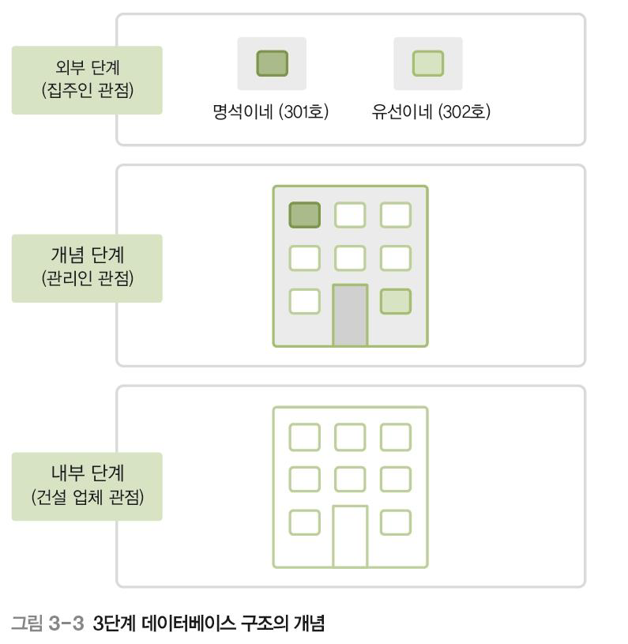
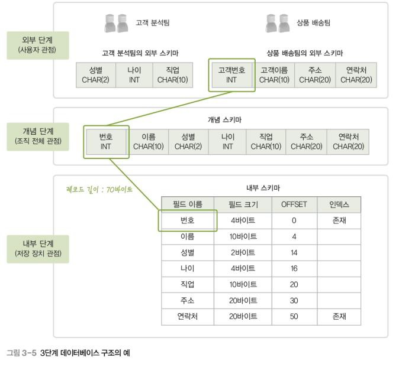
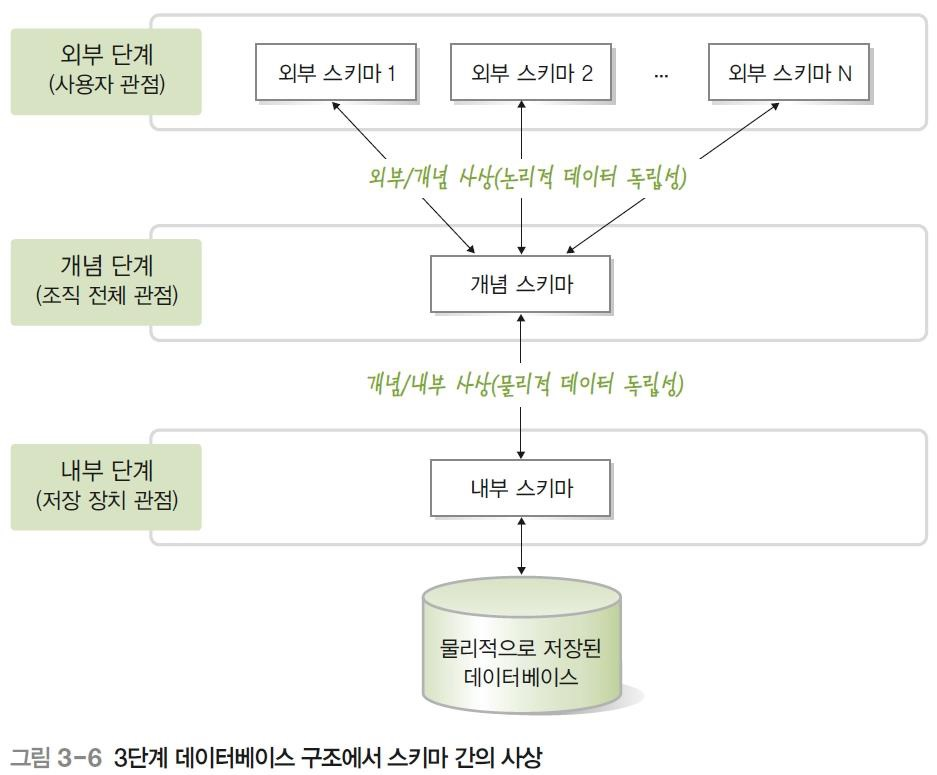

## Database란

#### 목차

[0. Data란?](#Data란?)

[1. 데이터베이스의 정의](#데이터베이스의-정의)

[2. 데이터베이스는 왜 나왔을까?](#데이터베이스는-왜-나왔을까?)

[3. 데이터베이스 특징](#데이터베이스-특징)

[4. DBMS](#DBMS)

[5. 스키마와 인스턴스](#스키마와-인스턴스)

[6. 데이터베이스 구조](#데이터베이스-구조)

### Data란?

데이터(data)란 현실 세계에서 단순히 관찰하거나 측정해 수집한 사실이나 값을 뜻한다. 

정보(information)는 의사 결정에 유용하게 활용할 수 있도록 데이터를 처리한 결과물이다.

### 데이터베이스 정의

**데이터베이스**는 여러 사람이 공유하여 사용할 목적으로 체계화해 통합, 관리하는 데이터의 집합이다.

**1. 공유 데이터**

- 특정 조직의 여러 사용자가 함께 소유하고 이용 가능한 공용 데이터

**2. 통합데이터**

- 최소의 중복과 통제 가능한 중복만 허용하는 데이터

**3. 저장 데이터**

- 컴퓨터가 접근할 수 있는 매체에 저장된 데이터

**4. 운영 데이터**

- 조직의 주요 기능을 수행하기 위해 지속적으로 꼭 필요한 데이터

### 데이터베이스는 왜 나왔을까?

데이터베이스 이전에는 파일 시스템(File system)을 사용했다. 

파일 시스템은 누구나 쉽게 사용할 수 있고 비용이 저렴하다는는 장점을 갖고 있다.

그러나,

파일 시스템의 여러 문제점으로 인해 데이터베이스를 사용하기 시작했다.

 

#### 파일 시스템의 문제점

- **데이터 중복성** 
  - 같은 내용의 데이터가 여러 파일에 중복 저장된다.
  - => 저장 공간의 낭비 
  - => 데이터 일관성, 무결성 유지 어려움

- **데이터 종속성**
  - 응용 프로그램이 데이터 파일에 종속적이다.
  - 즉, 데이터 파일 구조가 바뀌면 응용 프로그램도 바뀌어야 한다.

❔ **데이터 무결성(data integrity)**이란? ❔  

= 데이터의 정확성과 일관성을 유지하고 보증하는 것.

= 데이터의 정확성을 보장하기 위해 데이터의 변경이나 수정시 제한을 두어 데이터 상태들을 항상 옳게 유지하는 것

### 데이터베이스 특징

**1.  실시간 접근성 (Real-time accessiblity)** :  사용자의 데이터 요구에 실시간 처리 응답

**2.  지속적인 변화 (Continuous evolution)** : 새로운 데이터의 삽입, 삭제, 수정을 통하여 최신 데이터 유지

**3.  동시 공유 (Concurrent sharing)** : 여러 사용자가 동시에 원하는 데이터 공유

**4.  내용에 대한 참조 (contents reference)** : 데이터 참조시 데이터의 주소가 아닌 내용을 참조 

**5.  데이터 논리적 독립성** : 데이터의 논리적 구조를 변경시켜도 응용 프로그램은 변경되지 않음

### DBMS

DBMS(DataBase Management System)란 조직에 필요한 데이터를 데이터베이스에 통합하여 저장하고 관리하는 소프트웨어다.

**주요 기능**

**1. 정의 기능**

데이터베이스 구조를 정의하거나 수정할 수 있다.

**2. 조작 기능**

데이터를 삽입, 삭제, 수정, 검색하는 연산을 할 수 있다.

**3. 제어 기능**

데이터를 항상 정확하고 안전하게 유지할 수 있다.

#### 장단점

| 장점                         | 단점                         |
| ---------------------------- | ---------------------------- |
| 데이터 중복 통제             | 비용이 많이 든다             |
| 데이터 독립성 확보           | 백업/회복 방법 복잡          |
| 데이터 동시 공유             | 중앙 집중 관리로 인한 취약점 |
| 데이터 보안 향상             |                              |
| 데이터 무결성 유지           |                              |
| 장애 발생 시 회복 가능       |                              |
| 응용 프로그램 개발 비용 감소 |                              |

### 스키마와 인스턴스

**스키마(schema)**란 데이터베이스에 저장되는 데이터 구조와 제약조건을 정의한 것이다
ex) TABLE STUDENT

| 학번 | 이름     | 학과     | 학년 |
| ---- | -------- | -------- | ---- |
| INT  | CHAR(10) | CHAR(10) | INT  |

**인스턴스(instance)**란 스키마에 따라 데이터베이스에 실제로 저장된 값이다.

ex) TABLE STUDENT

| 학번     | 이름   | 학과         | 학년 |
| -------- | ------ | ------------ | ---- |
| 20200001 | 홍길동 | 컴퓨터공학과 | 1    |
| 20200002 | 김철수 | 컴퓨터공학과 | 2    |

STUDENT 테이블은 총 2개의 인스턴스를 가지고 있다.

### 데이터베이스 구조

데이터베이스의 사용자는 DBA, 응용 프로그래머, 최종 사용자로 나뉜다. 

응용 프로그래머라고 생각해보자. 

응용 프로그래머의 입장에서는 데이터를 잘 가져오면 될 뿐, 구조가 어떻게 되어 있는지는 알 필요 없다.  구조는 물리적인 구조을 뜻한다.

그렇다면 응용 프로그래머 입장에서는 필요없는 구조는 추상화를 해도 된다. 

❔ **추상화** : 복잡한 자료, 모듈, 시스템 등으로부터 핵심적인 개념 또는 기능을 간추려 내는 것

이러한 데이터베이스의 추상화를 구현한 것이 3단계 데이터베이스 구조이다.

3단계 데이터베이스 구조는 하나의 데이터베이스를 관점에 따라 세 단계로 나눈 것이다.

외부, 개념, 내부 단계로 나뉘어진다. 내부 단계에서 외부 단계로 갈수록 추상화 레벨이 높아진다.

**1. 외부 단계(External level)**
데이터베이스를 개별 사용자 관점에서 이해하고 표현하는 단계다.
데이터베이스 하나에 외부 스키마가 여러 개 존재할 수 있다.

 - 외부 스키마 (external schema)
   -  외부 단계에서 사용자에게 필요한 데이터베이스를 정의한 것이다.
   -  각 사용자가 생각하는 데이터베이스의 모습 , 즉 논리적 구조로 사용자마다 다르다.
   -  서브 스키마(sub schema)라고도 한다.

**2. 개념 단계(Conceptual level)**
데이터베이스를 조직 전체의 관점에서 이해하고 표현하는 단계다.
데이터베이스 하나에 개념 스키마가 하나만 존재한다.

- 개념 스키마 (conceptual schema)
  - 개념 단계에서 데이터베이스 전체의 논리적 구조를 정의한 것이다.
   - 조직 전체의 관점에서 생각하는 데이터베이스의 모습이다.
   - 전체 데이터베이스에 어떤 데이터가 저장되는지 , 데이터들 간에는 어떤 관계가 존재하고 어떤 제약조건이 존재하는지에 대한 정의뿐만 아니라 , 데이터에 대한 보안 정책이나 접근 권한에 대한 정의도 포함한다.

**3. 내부 단계(Internal level)**

데이터베이스를 저장 장치의 관점에서 이해하고 표현하는 단계다.
데이터베이스 하나에 내부 스키마가 하나만 존재한다.

- 내부 스키마 (internal schema)
  - 전체 데이터베이스가 저장 장치에 실제로 저장되는 방법을 정의한 것이다.
   - 레코드 구조 , 필드 크기 , 레코드 접근 경로 등 물리적 저장 구조를 정의한다.

#### 데이터 독립성

데이터 독립성이란 하위 스키마를 변경하더라도 상위 스키마가 영향을 받지 않는 특성을 뜻한다.

데이터베이스를 3단계 구조로 나누고 단계별로 스키마를 유지하며 스키마 사이의 대응 관계를 정의하면서 데이터 독립성을 실현할 수 있다.

#### References
[위키백과](https://ko.wikipedia.org/wiki/데이터베이스)

한빛아카데미 데이터베이스 개론