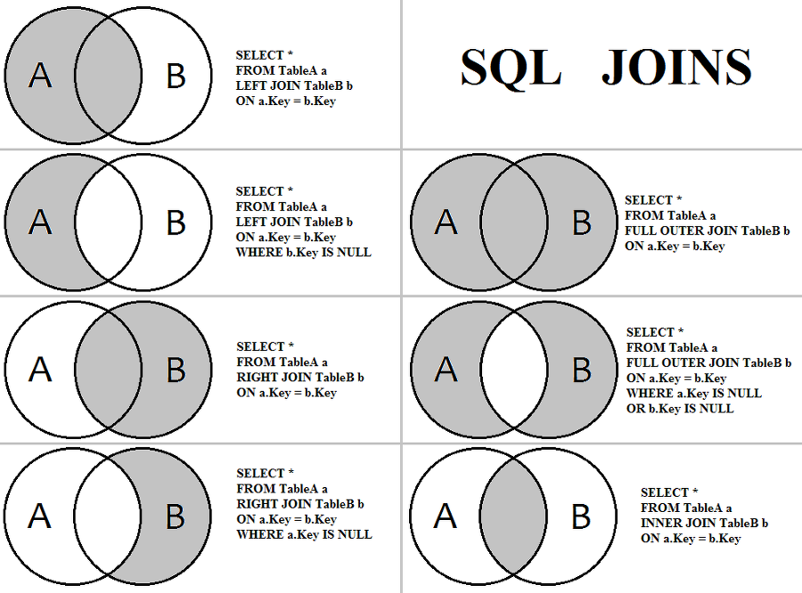

# JOIN

### JOIN이란

**개념**

- 두 개 이상의 테이블 들을 연결 또는 결합하여 데이터를 출력하는 것
- 관계형 데이터베이스의 가장 큰 장점이면서 대표적인 핵심 기능 

일반적인 경우 행들은 PRIMARY KEY(PK)나 FOREIGN KEY(FK) 값의 연관에 의해 JOIN이 성립된다. 

하지만 어떤 경우에는 이러한 PK, FK의 관계가 없어도 논리적인 값들의 연관만으로 JOIN이 성립 가능하다. 

<br/>

다음 테이블을 이용한다.

```sql
mysql> select * from emp;
+--------+----------+---------+
| emp_no | emp_name | dept_no |
+--------+----------+---------+
|     10 | A        |       1 |
|     20 | B        |       1 |
|     30 | C        |       4 |
|     40 | D        |       2 |
|     50 | E        |       3 |
|     60 | F        |       2 |
+--------+----------+---------+
mysql> select * from dept;
+---------+-----------+----------+
| dept_no | dept_name | location |
+---------+-----------+----------+
|       1 | engineer  | sinchon  |
|       2 | account   | incheon  |
|       3 | research  | mapo     |
|       4 | sales     | pangyo   |
+---------+-----------+----------+
```

<br/>

<br/>

### JOIN의 종류

Join의 종류에는

-  연산자에 따른 분류
  - EUQI JOIN
  - NON EUQI JOIN

- FROM 절의 JOIN 형태에 따른 분류
  - INNER JOIN
    - NATURAL JOIN
  - OUTER JOIN
  - SELF JOIN
  - CROSS JOIN

그림 첨부



<br/>

### INNER JOIN

내부 조인(INNER JOIN)은 가장 일반적인 조인 형태로 가장 많이 활용하는 조인 기법이다. 

내부 조인은 둘 이상의 테이블에 존재하는 공통 컬럼(속성)의 값이 같은 것을 결과로 추출한다. 

<br/>

내부 조인에는 대표적으로 동등 조인(EQUI JOIN), 자연 조인(NATURAL JOIN), 그리고 교차 조인(CROSS JOIN) 등으로 구분할 수 있습니다. 

<br/>

#### EQUI JOIN

EQUI(등가) JOIN은 **두 개의 테이블 간에 칼럼 값들이 서로 정확하게 일치하는 경우**에 사용되는 방법으로 대부분 PK ↔ FK의 관계를 기반으로 한다. 

그러나 일반적으로 테이블 설계 시에 나타난 PK ↔ FK의 관계를 이용하는 것이지 반드시 PK ↔ FK의 관계로만 EQUI JOIN이 성립하는 것은 아니다. 

JOIN의 조건은 ANSI/ISO SQL 표준 방식으로 ON절에 기술한다. 또는 WHERE 절에 기술하게 되는데 “=” 연산자를 사용해서 표현한다. 

다음은 EQUI JOIN의 대략적인 형태이다.

```sql
SELECT 테이블1.칼럼명, 테이블2.칼럼명, ... 
FROM 테이블1 
(INNER) JOIN 테이블2 
ON 테이블1.칼럼명1 = 테이블2.칼럼명2; 
→ ON 절에 JOIN 조건을 넣는다.

INNER는 JOIN의 디폴트 옵션으로 생략 가능하다. 

SELECT 테이블1.칼럼명, 테이블2.칼럼명, ... 
FROM 테이블1, 테이블2 
WHERE 테이블1.칼럼명1 = 테이블2.칼럼명2; 
→ WHERE 절에 JOIN 조건을 넣는다.
```

[예제] 

```sql
SELECT EMP.EMP_NAME, DEPT.DEPT_NAME;
FROM EMP, DEPT
WHERE EMP.DEPT_NO = DEPT.DEPT_NO;

---또는 INNER JOIN을 명시하여 사용할 수도 있다. 
SELECT EMP.EMP_NAME, DEPT.DEPT_NAME;
FROM EMP
INNER JOIN DEPT
ON EMP.DEPT_NO = DEPT.DEPT_NO;

[실행 결과]
+----------+-----------+
| emp_name | dept_name |
+----------+-----------+
| A        | engineer  |
| B        | engineer  |
| D        | account   |
| F        | account   |
| E        | research  |
| C        | sales     |
+----------+-----------+
```

<br/>

SQL을 보면 SELECT 구문에 단순히 칼럼명이 오지 않고 “테이블명.칼럼명”처럼 테이블명과 칼럼명이 같이 나타난다. 이렇게 특정 칼럼에 접근하기 위해 그 칼럼이 어느 테이블에 존재하는 칼럼인지를 명시하는 것은 두 가지 이유가 있다. 

1. 모든 테이블에 칼럼들이 유일한 이름을 가진다면 상관없지만, JOIN에 사용되는 두 개의 테이블에 같은 칼럼명이 존재하는 경우에는 D**BMS의 옵티마이저는 어떤 칼럼을 사용해야 할지 모르기 때문에 파싱 단계에서 에러가 발생**된다. 

2. **SQL에 대한 가독성이나 유지보수성을 높이는 효과**가 있다. 

> 하나의 SQL 문장 내에서 유일하게 사용하는 칼럼명이라면 칼럼명 앞에 테이블 명을 붙이지 않아도 된다.

<br/>

JOIN 조건은 ON절/ WHERE 절에 기술하며, JOIN은 두 개 이상의 테이블에서 필요한 데이터를 출력하기 위한 가장 기본적인 조건이다. 

>  주의!
>
> FROM 절에 여러 테이블이 나열되더라도 SQL에서 데이터를 처리할 때는 단 두 개의 집합 간에만 조인이 일어난다는 것이다. 
>
> FROM 절에 A, B, C 테이블이 나열되었더라도 특정 2개의 테이블만 먼저 조인 처리되고, 2개의 테이블이 조인되어서 처리된 새로운 데이터 집합과 남은 한 개의 테이블이 다음 차례로 조인되는 것이다. 
>
> 이 순서는 4개 이상의 테이블이 사용되더라도 같은 프로세스를 반복한다. 

<br/>

긴 테이블명을 계속 되풀이해서 입력하다보면 개발 생산성이 떨어지는 문제점과 함께 개발자의 실수가 발생할 가능성이 높아지는 문제가 있다. 

그래서 SELECT 절에서 칼럼에 대한 ALIAS를 사용하는 것처럼 FROM 절의 테이블에 대해서도 ALIAS를 사용할 수 있다. 

조회할 칼럼명 앞에 테이블명을 명시적으로 기술하는 것이 이론적으로는 가장 좋은 방법일 수 있지만, 테이블명이 길고 SQL의 복잡도가 높아지면 오히려 가독성이 떨어지기 때문에 테이블명 대신 ALIAS를 주로 사용한다. 

단일 테이블을 사용하는 SQL 문장에서는 필요성은 없지만 사용하더라도 에러는 발생하지 않으며, 여러 테이블을 사용하는 조인을 이용하는 경우는 매우 유용하게 사용할 수 있다.

<br/>

[예제] 칼럼과 테이블에 ALIAS를 적용한 SQL이다. 실행 결과는 ALIAS 적용 전과 같음을 확인 할 수 있다.

```sql
SELECT E.EMP_NAME, D.DEPT_NAME;
FROM EMP E, DEPT D
WHERE E.DEPT_NO = D.DEPT_NO;

---또는 INNER JOIN을 명시하여 사용할 수도 있다. 
SELECT E.EMP_NAME, D.DEPT_NAME;
FROM EMP E
INNER JOIN DEPT D
ON E.DEPT_NO = D.DEPT_NO;
```

<br/>

**WHERE 절 검색 조건 사례**

WHERE 절에서 **JOIN 조건 이외의 검색 조건에 대한 제한 조건을 덧붙여 사용할 수 있다**. 

즉, EQUI JOIN의 최소한의 연관 관계를 위해서 테이블 개수 - 1개의 JOIN 조건을 WHERE 절에 명시하고, 부수적인 제한 조건을 논리 연산자를 통하여 추가로 입력하는 것이 가능하다.

[예제] 위 SQL 문장의 WHERE 절에 포지션이 골키퍼인(포지션 코드는 ‘GK’임) 선수들에 대한 데이터만을 백넘버 순으로 출력하는 SQL문을 만들어 본다.

```sql
[예제] SELECT P.PLAYER_NAME 선수명, P.BACK_NO 백넘버, T.REGION_NAME 연고지, T.TEAM_NAME 팀명 
FROM PLAYER P, TEAM T
WHERE P.TEAM_ID = T.TEAM_ID AND P.POSITION = 'GK' 
ORDER BY P.BACK_NO; 

--또는 INNER JOIN을 명시하여 사용할 수도 있다. 
SELECT P.PLAYER_NAME 선수명, P.BACK_NO 백넘버, T.REGION_NAME 연고지, T.TEAM_NAME 팀명 
FROM PLAYER P 
INNER JOIN TEAM T 
ON P.TEAM_ID = T.TEAM_ID 
WHERE P.POSITION = 'GK' 
ORDER BY P.BACK_NO;
```

<br/>

**JOIN 조건을 기술할 때 주의해야 할 사항이 한 가지 있다. 만약 테이블에 대한 ALIAS를 적용해서 SQL 문장을 작성했을 경우, WHERE 절과 SELECT 절에는 테이블명이 아닌 테이블에 대한 ALIAS를 사용해야 한다는 점이다.** 

그러나, 권장 사항은 아니지만 하나의 SQL 문장 내에서 유일하게 사용하는 칼럼명이라면 칼럼명 앞에 ALIAS를 붙이지 않아도 된다.

<br/>

[예제] 위 SQL 문장에서 FROM 절에서 테이블에 대한 ALIAS를 정의했는데, SELECT 절이나 WHERE 절에서 테이블명을 사용한다면 DBMS의 옵티마이저가 칼럼명이 부적합하다는 에러를 파싱 단계에서 발생시킨다. (SQL 문장의 파싱 순서는 FROM 절, WHERE 절, SELECT 절, ORDER BY 절 순서이다.)

```sql
SELECT PLAYER.PLAYER_NAME 선수명, P.BACK_NO 백넘버, T.REGION_NAME 연고지, T.TEAM_NAME 팀명 
FROM PLAYER P, TEAM T 
WHERE P.TEAM_ID = T.TEAM_ID AND P.POSITION = 'GK' 
ORDER BY P.BACK_NO; 

SELECT PLAYER.PLAYER_NAME 선수명, P.BACK_NO 백넘버, * 1행에 오류: ERROR: 열명이 부적합하다.
```

<br/>

#### NATURAL JOIN

NATURAL JOIN은 두 테이블 간의 동일한 이름을 갖는 모든 컬럼들에 대해 EQUI(=) JOIN을 수행한다. 

NATURAL JOIN이 명시되면, 추가로 USING 조건절, ON 조건절, WHERE 절에서 JOIN 조건을 정의할 수 없다. 

[예제] 

```sql
mysql> select * from emp natural join dept;
+---------+--------+----------+-----------+----------+
| dept_no | emp_no | emp_name | dept_name | location |
+---------+--------+----------+-----------+----------+
|       1 |     10 | A        | engineer  | sinchon  |
|       1 |     20 | B        | engineer  | sinchon  |
|       2 |     40 | D        | account   | incheon  |
|       2 |     60 | F        | account   | incheon  |
|       3 |     50 | E        | research  | mapo     |
|       4 |     30 | C        | sales     | pangyo   |
+---------+--------+----------+-----------+----------+


mysql> select *
    -> from emp
    -> join dept
    -> on emp.dept_no = dept.dept_no;
+--------+----------+---------+---------+-----------+----------+
| emp_no | emp_name | dept_no | dept_no | dept_name | location |
+--------+----------+---------+---------+-----------+----------+
|     10 | A        |       1 |       1 | engineer  | sinchon  |
|     20 | B        |       1 |       1 | engineer  | sinchon  |
|     40 | D        |       2 |       2 | account   | incheon  |
|     60 | F        |       2 |       2 | account   | incheon  |
|     50 | E        |       3 |       3 | research  | mapo     |
|     30 | C        |       4 |       4 | sales     | pangyo   |
+--------+----------+---------+---------+-----------+----------+

```

 **'*' 와일드카드처럼 별도의 칼럼 순서를 지정하지 않으면 NATURAL JOIN의 기준이 되는 칼럼 들이 다른 칼럼보다 먼저 출력**된다. (ex: DEPTNO가 첫 번째 칼럼이 된다.) 

이때 NATURAL JOIN은 JOIN에 사용된 같은 이름의 칼럼을 **하나로 처리**한다.

NATURAL JOIN은 JOIN이 되는 테이블의 데이터 성격(도메인)과 칼럼명 등이 동일해야 하는 제약 조건이 있다. 간혹 모델링 상의 부주의로 인해 동일한 칼럼명이더라도 다른 용도의 데이터를 저장하는 경우도 있으므로 주의해서 사용해야 한다.

<br/>

[예제] NATURAL JOIN과 INNER JOIN의 차이를 자세히 설명하기 위해 DEPT_TEMP 테이블을 임시로 만든다.

```sql
CREATE TABLE dept_temp AS SELECT * FROM dept;

UPDATE dept_temp 
SET dept_name = 'R&D' 
WHERE dept_name = 'RESEARCH'; 

UPDATE dept_temp 
SET dept_name = 'MARKETING' 
WHERE dept_name = 'SALES'; 

SELECT * 
FROM dept_temp;

mysql> SELECT *
    -> FROM dept_temp;
+---------+-----------+----------+
| dept_no | dept_name | location |
+---------+-----------+----------+
|       1 | engineer  | sinchon  |
|       2 | account   | incheon  |
|       3 | R&D       | mapo     |
|       4 | MARKETING | pangyo   |
+---------+-----------+----------+
```

부서번호 3과 4의 dept_name이 'R&D'와 'MARKETING'으로 변경된 것을 확인할 수 있다.

<br/>

[예제] 세 개의 칼럼명이 모두 같은 DEPT와 DEPT_TEMP 테이블을 NATURAL [INNER] JOIN으로 수행한다.

```sql
mysql> select *
    -> from dept
    -> natural join dept_temp;
+---------+-----------+----------+
| dept_no | dept_name | location |
+---------+-----------+----------+
|       1 | engineer  | sinchon  |
|       2 | account   | incheon  |
+---------+-----------+----------+
```

위 SQL의 경우 dept_name의 내용이 바뀐 부서번호 데이터는 실행 결과에서 제외된 것을 알 수 있다.

<br/>

[예제] 다음에는 같은 조건이지만 출력 칼럼에서 차이가 나는 일반적인 INNER JOIN을 수행한다.

```sql
SELECT * 
FROM dept 
JOIN dept_temp 
ON dept.dept_no = dept_temp.dept_no 
	AND dept.dept_name = dept_temp.dept_name 
	AND dept.location = dept_temp.location; 

-- 위 SQL과 아래 SQL은 같은 결과를 얻을 수 있다. 
SELECT * 
FROM dept, dept_temp 
WHERE dept.dept_no = dept_temp.dept_no 
	AND dept.dept_name = dept_temp.dept_name 
	AND dept.location = dept_temp.location;
	
+---------+-----------+----------+---------+-----------+----------+
| dept_no | dept_name | location | dept_no | dept_name | location |
+---------+-----------+----------+---------+-----------+----------+
|       1 | engineer  | sinchon  |       1 | engineer  | sinchon  |
|       2 | account   | incheon  |       2 | account   | incheon  |
+---------+-----------+----------+---------+-----------+----------+
```

<br/>

#### Non EQUI JOIN

Non EQUI(비등가) JOIN은 두 개의 테이블 간에 칼럼 값들이 서로 정확하게 일치하지 않는 경우에 사용된다. 

Non EQUI JOIN의 경우에는 **“=” 연산자가 아닌 다른(Between, >, >=, <, <= 등) 연산자들을 사용하여 JOIN을 수행**하는 것이다. 

<br/>

이런 경우 Non EQUI JOIN을 시도할 수 있으나 데이터 모델에 따라서 Non EQUI JOIN이 불가능한 경우도 있다. 

다음은 Non EQUI JOIN의 대략적인 형태이다. 아래 BETWEEN a AND b 조건은 Non EQUI JOIN의 한 사례일 뿐이다.

```sql
SELECT 테이블1.칼럼명, 테이블2.칼럼명, ... 
FROM 테이블1, 테이블2 
WHERE 테이블1.칼럼명1 
BETWEEN 테이블2.칼럼명1 AND 테이블2.칼럼명2;
```

<br/>

[예제] Non EQUI JOIN에 대한 샘플은 K-리그 관련 테이블로 구현되지 않으므로, 사원(EMP) 테이블과 가상의 급여등급(SAL_GRADE) 테이블로 설명을 하도록 한다. 어떤 사원이 받고 있는 급여가 어느 등급에 속하는 등급인지 알고 싶다는 요구사항에 대한 Non EQUI JOIN의 사례는 다음과 같다.

```sql
[예제] 
SELECT E.ENAME, E.JOB, E.SAL, S.GRADE 
FROM EMP E, SALGRADE S 
WHERE E.SAL BETWEEN S.LOSAL AND S.HISAL;
```

<br/>

테이블 간의 관계를 설명하기 위해 먼저 사원(EMP) 테이블과 급여등급(SALGRADE) 테이블에 있는 데이터와 이들 간의 관계를 나타내는 [그림 Ⅱ-1-16]을 가지고 실제적인 데이터들이 어떻게 연결되는지 설명한다. 

급여등급(SALGRADE) 테이블에는 1급(700 이상 ~ 1200 이하), 2급(1201 이상 ~ 1400 이하), 3급(1401 이상 ~ 2000 이하), 4급(2001 이상 ~ 3000 이하), 5급(3001 이상 ~ 9999 이하)으로 구분한 5개의 급여등급이 존재한다고 가정한다.


사원(EMP) 테이블에서 사원들의 급여가 급여등급(SALGRADE) 테이블의 등급으로 표시되기 위해서는 “=” 연산자로 JOIN을 이용할 수가 없다. 

그래서 사원들과 사원들의 급여가 급여등급 테이블의 어느 급여등급에 해당되는지 알아보기 위해서 사원 테이블에 들어 있는 데이터를 기준으로 급여등급 테이블의 어느 등급에 속하는지 1:1로 해당하는 값들을 나열해 보면 아래 [그림 Ⅱ-1-17]과 같이 바꿀 수 있다.


단지 BETWEEN SQL 연산자가 Non EQUI JOIN을 설명하기 쉽기 때문에 예를 들어 설명한 것에 불과하며, 데이터 모델에 따라서 Non EQUI JOIN이 불가능한 경우도 있다. 

<br/>

<br/>

### OUTER JOIN

INNER(내부) JOIN과 대비하여 OUTER(외부) JOIN이라고 불리며, JOIN 조건에서 동일한 값이 없는 행도 반환할 때 사용할 수 있다.


[그림 Ⅱ-2-3]은 TAB1 테이블이 TAB2 테이블을 JOIN 하되, TAB2의 JOIN 데이터가 있는 경우는 TAB2의 데이터를 함께 출력하고, TAB2의 JOIN 데이터가 없는 경우에도 TAB1의 모든 데이터를 표시하고 싶은 경우이다. 

**TAB1의 모든 값에 대해 TAB2의 데이터가 반드시 존재한다는 보장이 없는 경우 OUTER JOIN을 사용하여 해결이 가능하다.** 

추가로 OUTER JOIN 역시 JOIN 조건을 FROM 절에서 정의하겠다는 표시이므로 USING 조건절이나 ON 조건절을 필수적으로 사용해야 한다. 

그리고, LEFT/RIGHT OUTER JOIN의 경우에는 기준이 되는 테이블이 조인 수행시 무조건 드라이빙 테이블이 된다. 

옵티마이저는 이 원칙에 위배되는 다른 실행계획을 고려하지 않는다.

<br/>

> 📖 드라이빙 테이블이란?
>
> 조인시 **먼저 액세스되는 쪽을 드라이빙 테이블(DRIVING** **TABLE, OUTER TABLE)**이라고 하며,
>
> 나중에 **액세스 되는 테이블을 드리븐 테이블(DRIVEN TABLE, INNER TABLE)**이라고 한다.

<br/>

EMP, DEPT 테이블에 데이터를 입력한다.

```sql
insert into emp (emp_no, emp_name) values (70,'G'),(80,'H');
insert into dept values (5,'infra','gangnam'),(6,'business','yangjae');
```

<br/>

#### LEFT OUTER JOIN

조인 수행시 먼저 표기된 좌측 테이블에 해당하는 데이터를 먼저 읽은 후, 나중 표기된 우측 테이블에서 JOIN 대상 데이터를 읽어 온다. 

즉, Table A와 B가 있을 때(Table 'A'가 기준이 됨), A와 B를 비교해서 B의 JOIN 칼럼에서 같은 값이 있을 때 그 해당 데이터를 가져오고, 

B의 JOIN 칼럼에서 같은 값이 없는 경우에는 B 테이블에서 가져오는 칼럼들은 NULL 값으로 채운다. 

그리고 LEFT JOIN으로 OUTER 키워드를 생략해서 사용할 수 있다.

```sql
select emp.emp_no,emp.emp_name,emp.dept_no,dept.dept_name,dept.location 
from emp 
left join dept 
on dept.dept_no = emp.dept_no;
+--------+----------+---------+-----------+----------+
| emp_no | emp_name | dept_no | dept_name | location |
+--------+----------+---------+-----------+----------+
|     10 | A        |       1 | engineer  | sinchon  |
|     20 | B        |       1 | engineer  | sinchon  |
|     30 | C        |       4 | sales     | pangyo   |
|     40 | D        |       2 | account   | incheon  |
|     50 | E        |       3 | research  | mapo     |
|     60 | F        |       2 | account   | incheon  |
|     70 | G        |    NULL | NULL      | NULL     |
|     80 | H        |    NULL | NULL      | NULL     |
+--------+----------+---------+-----------+----------+
```

<br/>

#### RIGHT OUTER JOIN

조인 수행시 LEFT JOIN과 반대로 우측 테이블이 기준이 되어 결과를 생성한다. 즉, TABLE A와 B가 있을 때(TABLE 'B'가 기준이 됨), A와 B를 비교해서 A의 JOIN 칼럼에서 같은 값이 있을 때 그 해당 데이터를 가져오고, A의 JOIN 칼럼에서 같은 값이 없는 경우에는 A 테이블에서 가져오는 칼럼들은 NULL 값으로 채운다. 그리고 RIGHT JOIN으로 OUTER 키워드를 생략해서 사용할 수 있다.

```sql
select emp.emp_no,emp.emp_name,dept.dept_no,dept.dept_name,dept.location 
from emp 
right join dept 
on dept.dept_no = emp.dept_no;
+--------+----------+---------+-----------+----------+
| emp_no | emp_name | dept_no | dept_name | location |
+--------+----------+---------+-----------+----------+
|     10 | A        |       1 | engineer  | sinchon  |
|     20 | B        |       1 | engineer  | sinchon  |
|     40 | D        |       2 | account   | incheon  |
|     60 | F        |       2 | account   | incheon  |
|     50 | E        |       3 | research  | mapo     |
|     30 | C        |       4 | sales     | pangyo   |
|   NULL | NULL     |       5 | infra     | gangnam  |
|   NULL | NULL     |       6 | business  | yangjae  |
+--------+----------+---------+-----------+----------+
```

<br/>

#### FULL OUTER JOIN

조인 수행시 좌측, 우측 테이블의 모든 데이터를 읽어 JOIN하여 결과를 생성한다. 

즉, TABLE A와 B가 있을 때(TABLE 'A', 'B' 모두 기준이 됨), RIGHT OUTER JOIN과 LEFT OUTER JOIN의 결과를 합집합으로 처리한 결과와 동일하다. 

그리고 FULL JOIN으로 OUTER 키워드를 생략해서 사용할 수 있다.

```sql
mysql> select emp.emp_no,emp.emp_name,emp.dept_no,dept.dept_name,dept.location
    -> from emp
    -> left join dept
    -> on dept.dept_no = emp.dept_no
    
    -> union
    
    -> select emp.emp_no,emp.emp_name,dept.dept_no,dept.dept_name,dept.location
    -> from emp
    -> right join dept
    -> on dept.dept_no = emp.dept_no;
+--------+----------+---------+-----------+----------+
| emp_no | emp_name | dept_no | dept_name | location |
+--------+----------+---------+-----------+----------+
|     10 | A        |       1 | engineer  | sinchon  |
|     20 | B        |       1 | engineer  | sinchon  |
|     30 | C        |       4 | sales     | pangyo   |
|     40 | D        |       2 | account   | incheon  |
|     50 | E        |       3 | research  | mapo     |
|     60 | F        |       2 | account   | incheon  |
|     70 | G        |    NULL | NULL      | NULL     |
|     80 | H        |    NULL | NULL      | NULL     |
|   NULL | NULL     |       5 | infra     | gangnam  |
|   NULL | NULL     |       6 | business  | yangjae  |
+--------+----------+---------+-----------+----------+
```

<br/>

<br/>

### CROSS JOIN

CROSS JOIN은 PRODUCT의 개념으로 테이블 간 JOIN 조건이 없는 경우 **생길 수 있는 모든 데이터의 조합**을 말한다. 

두 개의 테이블에 대한 CARTESIAN PRODUCT 또는 CROSS PRODUCT와 같은 표현으로, 결과는 양쪽 집합의 M*N 건의 데이터 조합이 발생한다. 

```sql
mysql> select emp.emp_name, dept.dept_name from emp cross join dept;
+----------+-----------+
| emp_name | dept_name |
+----------+-----------+
| A        | engineer  |
| A        | account   |
| A        | research  |
| A        | sales     |
| A        | infra     |
| A        | business  |
| B        | engineer  |
| B        | account   |
| B        | research  |
| B        | sales     |
| B        | infra     |
| B        | business  |
| C        | engineer  |
| C        | account   |
| C        | research  |
| C        | sales     |
| C        | infra     |
| C        | business  |
| D        | engineer  |
| D        | account   |
| D        | research  |
| D        | sales     |
| D        | infra     |
| D        | business  |
| E        | engineer  |
| E        | account   |
| E        | research  |
| E        | sales     |
| E        | infra     |
| E        | business  |
| F        | engineer  |
| F        | account   |
| F        | research  |
| F        | sales     |
| F        | infra     |
| F        | business  |
| G        | engineer  |
| G        | account   |
| G        | research  |
| G        | sales     |
| G        | infra     |
| G        | business  |
| H        | engineer  |
| H        | account   |
| H        | research  |
| H        | sales     |
| H        | infra     |
| H        | business  |
+----------+-----------+
48 rows in set (6*8)
```

<br/>

NATURAL JOIN의 경우 WHERE 절에서 JOIN 조건을 추가할 수 없지만, CROSS JOIN의 경우 WHERE 절에 JOIN 조건을 추가할 수 있다. 

그러나, 이 경우는 CROSS JOIN이 아니라 INNER JOIN과 같은 결과를 얻기 때문에 CROSS JOIN을 사용하는 의미가 없어지므로 권고하지 않는다.

```sql
mysql> select emp_name,dept_name
    -> from emp
    -> cross join dept
    -> where emp.dept_no = dept.dept_no;
+----------+-----------+
| emp_name | dept_name |
+----------+-----------+
| A        | engineer  |
| B        | engineer  |
| C        | sales     |
| D        | account   |
| E        | research  |
| F        | account   |
+----------+-----------+
-- 위 SQL과 아래 SQL은 같은 결과를 얻을 수 있다. 
SELECT ENAME, DNAME 
FROM EMP 
INNER JOIN DEPT 
WHERE EMP.DEPTNO = DEPT.DEPTNO;
```

<br/>

<br/>

### 주의사항

- **SQL 문장의 의미를 제대로 파악**해야 한다. SQL을 어떻게 작성하느냐에 따라 성능이 크게 좌우된다. 그러므로 어떤 질의를 수행할 것인지를 명확하게 정의한 후, 비효율을 제거하여 최적의 SQL을 작성해야 한다.

- **조인 조건을 명확하게 제공**해야 한다. 조인 조건을 명확하게 제공하지 않을 경우, 의도치 않게 CROSS JOIN(Cartesian Product)가 수행될 수 있다.

- **조인 적용 후 테스트를 수행**해야 한다. 적은 수의 테이블을 조인할 때는 큰 문제가 없지만, 여러 개의 테이블을 조인할 때는 예상하지 않은 결과를 얻을 수 있다. 이때, 각각의 조인을 따로 테스트하면, 문제가 발생했을 경우 빠르면서도 쉽게 해결할 수 있다.

<br/>

### 고려사항

- **조인 대상의 양을 최소화**
  - 즉, 집합을 최소화할 방법이 있으면, 조건을 먼저 적용하여 관계를 맺을 집합을 최소화한 후, 조인을 맺는 것이 효율적이다.

- **효과적인 인덱스의 활용**
  - 인덱스를 활용하면, 조인 연산의 비용을 극적으로 낮출 수 있다.

<br/>

### 마무리

관계형 데이터베이스의 큰 장점이면서, SQL 튜닝의 중요 대상이 되는 **JOIN을 잘못 기술하게 되면 시스템 자원 부족이나 과다한 응답시간 지연을 발생**시키는 중요 원인이 되므로 JOIN 조건은 신중하게 작성해야 한다.

<br/><br/>

### REFERENCE

 [wisoft_tistory](https://wisoft.tistory.com/entry/database-sql-join-method#footnote_link_10_2)

[DBGUIDE - JOIN](http://www.dbguide.net/db.db?cmd=view&boardUid=148197&boardConfigUid=9&categoryUid=216&boardIdx=134&boardStep=1)