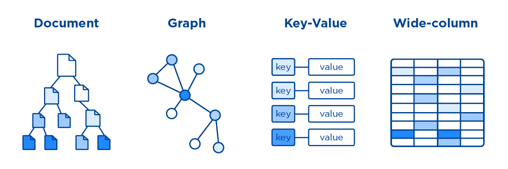

## NoSQL

 

### NoSQL란?

**NoSQL**(non SQL 또는 non relational) 데이터베이스는 전통적인 관계형 데이터베이스보다 덜 제한적인  일관성 모델을 이용하는 데이터의 저장 및 검색을 위한 매커니즘을 제공한다.   

이러한 접근에 대한 동기에는 디자인의 단순화, 수평적 확장성, 세세한 통제를 포함한다.   

NoSQL 데이터베이스는 단순 검색 및 추가 작업을 위한 매우 최적화된 키 값(Key-Value) 저장 공간으로, 레이턴시와 스루풋과 관련하여 상당한 성능 이익을 내는 것이 목적이다.   

NoSQL 데이터베이스는 빅데이터와 실시간 웹 애플리케이션의 상업적 이용에 널리 쓰인다. 또, NoSQL 시스템은 SQL 계열 쿼리 언어를 사용할 수 있다는 사실을 강조한다는 면에서 "Not only SQL"로 불리기도 한다.   

 

> 정형 데이터? 반정형 데이터? 비정형 데이터?
>
>  
>
> 정형 데이터란 형태가 있으며 연산이 가능한 데이터이다. 데이터를 다루는 사람이라면 흔하게 보게 되는 형식의 데이터이다.
>
> ex. 관계형 데이터베이스(RDB), 스프레드시트, CSV 등
>
>  
>
> 반정형 데이터란 형태(Schema, Meta Data)가 있으며, 연산이 불가능한 데이터이다.
>
> ex. XML, HTML, JSON, 로그 형태 등
>
>  
>
> 비정형 데이터란 형태가 없으며, 연산도 불가능한 데이터이다.
>
> ex. 소셜데이터(트위치, 페이스북), 영상, 이미지, 음성, 텍스트(word, PDF...) 등

 

### NoSQL의 특징

 

 NoSQL 데이터베이스는 기존의 관계형 데이터베이스보다 더 융통성있는 데이터 모델을 사용하고 데이터의 저장 및 검색을 위한 특화된 메커니즘을 제공한다. 이를 통해 NoSQL 데이터베이스는 단순 검색 및 추가작업에 있어서 매우 최적화된 키 값 저장 기법을 사용하여 응답속도나 처리효율 등에 있어서 매우 뛰어난 성능을 나타낸다.

- **유연성** 
  - 데이터의 스키마와 속성들을 다양하게 수용하고 동적으로 정의(Schemaless)

  - NoSQL 데이터베이스는 일반적으로 유연한 스키마를 제공하여 보다 빠르고 반복적인 개발을 가능하게 해준다. 이같은 유연한 데이터 모델은 NoSQL 데이터베이스를 반정형 및 비정형 데이터에 이상적으로 만들어 준다.
- **확장성** 
  - NoSQL 데이터베이스는 일반적으로 고가의 강력한 서버를 추가하는 대신 분산형 하드웨어 클러스터를 이용해 확장하도록 설계되었다. 일부 클라우드 제공자들은 완전관리형 서비스로서 이런 운영 작업을 보이지 않게 처리한다.
- **고성능** 
  - NoSQL 데이터베이스는 특정 데이터 모델 및 액세스 패턴에 대해 최적화되어 관계형 데이터베이스를 통해 유사한 기능을 충족하려 할 때보다 뛰어난 성능을 얻게 해준다.
- **고기능성**
  -  NoSQL 데이터베이스는 각 데이터 모델에 맞춰 특별히 구축된 뛰어난 기능의 API와 데이터 유형을 제공한다.

- etc
  - 관계형 모델을 사용하지 않으며 테이블 간 연결해서 조회할 수 있는 조인 기능이 없음
  - 관계형 데이터베이스에서는 지원하는 데이터 처리 완결성(Transaction, ACID 지원)이 보장되지 않음
  - 대다수의 제품이 Open Source로 제공

 

### NoSQL CAP 이론

CAP 이론에 따르면 **분산 데이터베이스 시스템은 네트워크 파티션이 발생하였을 때 세 가지 속성 중 두 가지만 만족할 수 있다.** 

 

- **Consistency** 
  - **일관성**을 뜻한다. 모든 클라이언트들은 항상 같은 데이터를 볼 수 있어야 한다. 
  - 한 데이터를 동시에 두 클라이언트가 바라봤을 때 그 데이터가 항상 같아야만 만족한다
- **Availability** 
  -  **가용성**을 뜻한다. 각 클라이언트는 항상 데이터를 읽고 쓸 수 있어야만 한다. 
  - 어떤 상황이던 간에 (장애가 발생해도) 정상적으로 데이터를 읽고 쓸 수 있어야 만족한다.
- **Partition Tolerance** 
  -  **파티션 허용, 분산화 가능**을 뜻합니다. 물리적인 네트워크 분산 환경에서도 시스템이 잘 작동해야 만족한다.

 

NoSQL은 <u>AP 또는 CP의 특징을 만족</u>합니다. 

데이터의 신뢰성보다는 분산에 중점을 둔 방식이라 약간의 데이터의 유실, 변형 등이 발생할 수 있습니다. 하지만 빠르게 확장을 하여 대규모 데이터를 저장하고 핸들링 할 수 있는 구조를 갖출 수 있도록 합니다. 

기존의 RDBMS 형태에는 없는 특징을 가져가는 대신 C나 A 하나를 포기할 수 밖에 없습니다.

 

> 참고.
>
> 기존의 RDBMS는 이 3가지 특징 중 CA 2가지를 만족합니다. 
>
> 분산화 특성 보다는 데이터의 일관성과 가용성에 중점을 둔 형태라고 볼 수 있습니다. 즉, 시스템의 신뢰성이 높다는 특징을 가집니다. 
>
> 분산 구조로 가져가는 것이 가능하지만 Replication의 경우 퍼포먼스를 고려해야 하며, Sharding의 경우 데이터의 관계가 무너질 수 있는 부담감이 있습니다. 
>
> 이러한 경우 신뢰성이 깨지는 리스크가 발생할 수 있습니다. 
>
> 애초에 분산적인 처리보다는 신뢰성에 중점을 두고 만들어진 방식이기 때문에 발생하는 부분입니다.

 

### NoSQL의 종류

 

 

- **Key Value DB**
  - 키-값 데이터베이스는 간단한 키-값 메소드를 사용하여 데이터를 저장하는 비관계형 데이터베이스 유형이다. 
  - 키-값 데이터베이스는 키를 고유한 식별자로 사용하는 키-값 쌍의 집합으로 데이터를 저장한다. 단순한 객체에서 복잡한 집합체에 이르기까지 무엇이든 키와 값이 될 수 있다. 
  - 키-값 데이터베이스는 파티셔닝이 가능하고 다른 유형의 데이터베이스로는 불가능한 범위까지 수평 확장이 가능하다. 
  - Redis, Memcached 

 

- **Wide Columnar Store**
  - Key Value 에서 발전된 형태의 Column Family 데이터 모델을 사용하고 있다.
  - HBase, Cassandra, ScyllaDB

 

- **Document DB**
  - 문서 데이터베이스는 JSON 유사 형식의 문서로 데이터를 저장 및 쿼리하도록 설계된 비관계형 데이터베이스 유형이다. 
  - 문서 데이터베이스를 사용하면 개발자들이 자신의 애플리케이션 코드에서 사용하는 것과 동일한 문서 모델 형식을 사용하여 데이터베이스에서 보다 손쉽게 데이터를 저장하고 쿼리할 수 있다. 문서 및 문서 데이터베이스의 유연하고 반구조화된 계층적 특성을 통해 개발자는 계속해서 애플리케이션의 요구를 발전시킬 수 있다. 
  - 문서 모델은 각 문서가 고유하고 시간에 따라 진화하는 콘텐츠 관리 시스템, 사용자 프로파일 및 카탈로그와 같은 사용 사례에 유용하다. 문서 데이터베이스에서는 유연한 인덱싱, 강력한 임시 쿼리, 문서 모음에 대한 분석을 지원한다.
  - MongoDB, CoughDB 등

 

- **Graph DB**
  - Euler & Graph Theory에서 유래한 DB다. Nodes, Relationship, Key-Value 데이터 모델을 채용하고 있다. 
  - 그래프 데이터베이스는 관계를 저장하고 탐색하도록 특별히 구축되었다. 관계는 그래프 데이터베이스에서 매우 중요한 존재이기 때문에 그래프 데이터베이스의 가치는 대부분 이러한 관계에서 파생된다. 
  - 그래프 데이터베이스는 노드를 사용하여 데이터 엔터티를 저장하고 엣지로는 엔터티 간의 관계를 저장한다. 엣지는 항상 시작 노드, 끝 노드, 유형과 방향을 가지며, 상-하위 관계, 동작, 소유자 등을 문서화한다. 하나의 노드가 가질 수 있는 관계의 수와 종류에는 제한이 없다.
  - 그래프 데이터베이스의 그래프는 특정 엣지의 유형 또는 전체 그래프를 전반을 통하여 순회할 수 있다. 그래프 데이터베이스에서 노드 간의 관계는 쿼리 시간에는 포함되지 않지만 데이터베이스에서 유지되기 때문에 조인 또는 관계를 순회하는 속도가 매우 빠르다. 
  - 그래프 데이터베이스는 데이터 간의 관계를 만들고 이러한 관계를 신속하게 쿼리해야 할 때 소셜 네트워킹, 추천 엔진, 이상 탐지 등의 사용 사례에 유용하다.
  - Neo4J, OreientDB 등

 

### NoSQL 장단점

**NoSQL의 장점**

- 데이터 분산에 용이
- 복제 및 장애대응(Recovery)에 용이
- 데이터를 고속으로 처리할 필요가 있는 경우
- 로그 등 계속 적재되야하고 대량의 데이터를 저장하고 싶은 경우 용이

 

**NoSQL의 단점**

- 각 솔루션의 특징을 이해할 필요가 있음. 학습곡선이 높다

- 새로운 기술로 분류되기 때문에 운영에 대한 노하우가 부족

- RDBMS와 비교하여 아직 버그가 상대적으로 많은 상태

- 보안에 취약하기 때문에 별도의 보안 체계를 마련

- 데이터 모델링의 어려움

  

 

 

### REFERENCE

 [개발자를 꿈꾸는 프로그래머- [NoSQL 이란?]](https://jwprogramming.tistory.com/70)

[NoSQL이란 무엇인가? 대량데이터 동시처리위한 DBMS 종류와 특징](https://www.samsungsds.com/global/ko/support/insights/1195843_2284.html)

[정형(Structured), 반정형(Semi-Structured), 비정형(Unstructured) 데이터](https://deep-jin.tistory.com/entry/정형-반정형-비정형-데이터)

[NoSQL이란?](https://aws.amazon.com/ko/nosql/)

[NoSQL의 특징 #1](https://flowarc.tistory.com/entry/NoSQL의-특징?category=722578)

[NoSQL의 특징 #2](https://flowarc.tistory.com/entry/NoSQL의-특징-2?category=722578)