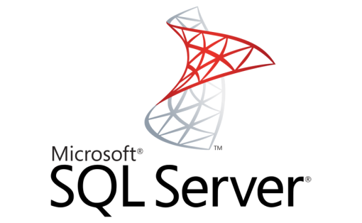

## RDB와 RDBMS

### RDB란

관계형 데이터베이스(Relational DataBase)는 키(key)와 값(value)들의 간단한 관계를 테이블화 시킨 데이터베이스다.

쉽게 생각하면 엑셀에 데이터를 저장하는 것과 유사하다.

  

### RDBMS의 정의

**관계형 데이터베이스 관리 시스템**(Relational Database Management System)은 IBM 산호세 연구소의 에드거 F. 커드가 도입한 관계형 모델을 기반으로 하는 데이터베이스 관리 시스템이다. 현재 사용되는 대부분의 데이터베이스는 관계형 데이터베이스 모델을 기반으로 한다.

  

### RDB 구성

| 개념                          | 설명                                                         |
| ----------------------------- | ------------------------------------------------------------ |
| 릴레이션(Relation)            | 하나의 개체에 관한 데이터를 2차원 테이블 구조로 저장한 것이다. |
| 속성(Attribute) / 필드(Field) | 릴레이션의 열에 해당한다.                                    |
| 차수(Degree)                  | 하나의 릴레이션에서 속성의 전체 개수를 의미한다.             |
| 투플(Tuple) / 레코드(Record)  | 릴레이션의 행에 해당한다.                                    |
| 카디널리티(Cardinality)       | 하나의 릴레이션에서 투플의 전체 개수를 의미한다.             |
| 널(Null)                      | 속성 값을 아직 모르거나 해당되는 값이 없음을 표현한다.       |

 

EX. STUDENT

| 학번      | 이름   | 학과         | 학년 |
| --------- | ------ | ------------ | ---- |
| 202000001 | 김컴공 | 컴퓨터공학과 | 1    |
| 202000002 | 이경영 | 경영학과     | 2    |
| 202000003 | 박기계 | 기계공학과   | 2    |
| 202000004 | 최산업 | 산업공학과   | 4    |

> STUDENT라는 릴레이션은 (학번, 이름, 학과, 학년)이라는 속성과 4개의 튜플을 가졌다. 차수는 4이고, 카디널리티는 4이다. 

  

### RDBMS의 특징

**데이터는 정해진 데이터 스키마를 따라 DB 테이블에 저장된다.**  

- 다만, 기존에 작성된 스키마를 수정하기가 어렵다.
- 테블 구조의 변경시 많은 패널티가 따른다.

 

**범용적이고 안정적이며 데이터의 일관성을 보장한다.**

- 테이블 내의 여러 데이터 제약을 통해 데이터의 중복을 방지합니다.

- 오랫동안 사용된 만큼 신뢰성이 높고, 어떤 상황에서도 데이터의 무결성을 보장해 줍니다.

 

**SQL(Structured Query Language)를 사용한다.**

- 복잡한 형태의 쿼리가 가능해서 원하는 데이터를 추출할수 있다. (join등의 연산을 지원)

 

**데이터는 관계를 통해서 연결된 여러 개의 테이블에 분산됩니다.**   

- 테이블간의 관계를 맺는 과정이 굉장히 복잡하다.

 

 **다른 DBMS 보다 더 많은 자원이 활용되어 시스템의 부하가 높다.**

  

### RDB의 종류

|        | ORACLE              | MSSQL SERVER | MYSQL                | MARIA DB            | POSTGRESQL          |
| ------ | ------------------- | ------------ | -------------------- | ------------------- | ------------------- |
| 비용   | 무료/유료           | 무료/유료    | 무료/유료            | 무료                | 무료                |
| 기업   | Oracle              | Microsoft    | opensource -> Oracle | X (Opensource)      | X (opensource)      |
| 플랫폼 | 윈도우, 유닉스 기반 | 윈도우       | 윈도우, 유닉스 기반  | 윈도우, 유닉스 기반 | 윈도우, 유닉스 기반 |

  

**ORACLE**

- 오라클은 'Oracle Corporation'에서 개발한 관계 데이터베이스 관리 시스템이다. 규모가 매우 크며, 다중 사용자가 사용 가능하다.

- 현재 가장 많이 쓰이는 RDBMS중 하나이고 사실상 SQL의 표준라고 볼 수 있다.

- 윈도우, 유닉스 기반의 모든 플랫폼에서 사용이 가능하다.

- 오라클은 충분한 큰 예산과 복잡한 비즈니스 요구와 기업 고객을 위해 설계되었다

- 고급 기능 지원(ex.  Oracle Management Server, Administrative Alerts,  Capacity Planning, Query Optimizer etc)

> 참고
>
> 1. Oracle Management Server
>
> - 중앙 집중 방식으로 Administration monitoring이 가능하고, Multiple databases를 튜닝 가능합니다.
>
> - 다른 Admin User들과 공유가 가능합니다.
>
> 2. Oracle Change Manager
>
> - 변경 Plan을 작성하고 실제 구현하기 전에 변경 사항의 효과를 볼 수 있습니다.
>
> - 생산 시스템을 방해하지 않습니다.
>
> 3. Administrative Alerts
>
> - 오류가 발생하면 오라클은 이메일이나 설정되어 있는 계정으로 연락을 줄수 있습니다.
>
> - 경고는 예정된 가동 정지 시간 동안 차단 될 수 있습니다. 
>
> 4. Capacity Planning
>
> - 업그레이드 관리자의 계획을 돕기 위해 사용 패턴을 추적할 수 있습니다.
>
> - 병목 현상을 쉽게 파악 할 수 있습니다.
>
> 5. Query Optimizer
>
> - 쿼리 최적화 프로그램으로 오라클은 SQL문을 실행하는 가장 효율적인 방법을 선택합니다.
>
> - Cost 비용을 최소화하기 위해 테이블과 인덱스를 분석 합니다. (Oracle 10g 이상부터는 Cost_Base)

 

**MS SQL server**

- 1989년 Microsoft에서 SQL Server 1.0을 처음 16bits기반의 서버에서 작동 가능하게끔 서비스를 시작하였다.

- 오직 윈도우 플랫폼에서 사용이 가능하다.

 

 

**MYSQL**

- 1995년 처음 MySQL의 상용버전으로 서비스를 시작하였다.

- 오픈소스 커뮤니티를 통해서 개발된 RDBMS이다.

- 처음에는 다른 데이터 베이스에 비해서 가벼운 데이터베이스를 목표로 개발 되었기 때문에 필요한 최소의 기능만을 탑재되었다.

- 현재는 Oracle에 합병이 되어, 주기적인 관리와 확장된 기능을 통해서 다른 RDBMS에 비해서 오히려 더 좋고 안정된 기능을 가지기도 한다.

- MySQL은 특성과 용도(상업적/비상업적)에 따라 무료 버전과 유료 버전을 가지고 있다. 
- MySQL은 매우 빠른 속도, 멀티스레드, 다중 사용자 지원, 튼튼한 데이터베이스 서버 등의 특징이 있습니다.

> 참고
>
> 1. 제일 큰 특징으로는 사용하기가 타 DBMS보다 쉽습니다.
>
> 2. 비용이 무료인 GUI 툴이 많습니다.
>
> 3. 매우 적은 오버헤드를 사용합니다.
>
> - MySQL은노트북에 단지 1Mb의 RAM만 사용합니다.
>
> - 오라클 9i를 설치하는 경우 128Mb를 사용합니다.
>
> 4. 고급기능을 지원하기 시작하였습니다.
>
> - Stored Procedures, Triggers, View, Sub-Queries, Transactional Table, Cascading Update & Delete
>
> - 타사 InnoDB Storage Engine을 사용할 수 있습니다.

  

**postgreSQL**

- 오픈소스 커뮤니티에서 같이 개발한 소프트웨어입니다.

- 상당히 실험적이고 진보적인 기능을 추구하여 최근 업데이트되는 기능들을 봐도 현재 필요한 부분을 고안해서 개발하는 것이 느껴지는 RDBMS이다.

> 참고
>
> - '신뢰도'는 제품의 최우선 사항
> - ACID 및 트랜잭션 지원
> - 다양한 인덱싱 기법 지원
> - 유연한 Full-text search 기능
> - 동시성 성능을 높여주는 MVCC 기능
> - 다양하고 유연한 복제 방식 지원
> - 다양한 프로시져(PL/pgSQL, Perl, Python, Ruby, TCL, 등)/인터페이스(JDBC, ODBC, C/C++, .Net, Perl, Python, 등) 언어
> - 질 좋은 커뮤니티 지원 및 상업적인 지원
> - 잘 만든 문서 및 충분한 매뉴얼 제공

  

**MariaDB**

- MariaDB는 오픈 소스의 관계형 데이터베이스 관리 시스템(RDBMS)이다. MySQL과 동일한 소스 코드를 기반으로 하며, GPL v2 라이선스를 따른다. 오라클오라클 소유의 현재 불확실한 MySQL의 라이선스 상태에 반발하여 만들어졌으며, 배포자는 몬티 프로그램 AB(Monty Program AB)와 저작권을 공유해야 한다.이것은 MySQL과 높은 호환성을 유지하기 위함이다.

- 마리아DB는 MySQL과 소스코드를 같이 하므로 사용방법과 구조가 MySQL과 동일하다. 이름만 다르지 명령어나 사용방법 모두 MySQL과 동일하다. 

- 근본적인 차이점은 마리아DB는 GPL v2 라이선스를 따르는 순수한 오픈소스 프로젝트이기에 오라클로부터 자유롭다. 누구나 필요로 하면 커뮤니티를 통해 마리아DB를 내려받아 쓸 수 있다.

- 마리아DB 커뮤니티는 MySQL과 비교해 애플리케이션 부분 속도가 약 4~5천배 정도 빠르며, MySQL이 가지고 있는 모든 제품의 기능을 완벽히 구현하면서도 성능 면에서는 최고 70%의 향상을 보이고 있다고 주장한다.

  

**SQLite**

- 최근 전자산업이 발달하면서 임베디드 시스템이 중요해지면서 임베디드에 쓰일 목적으로 개발된 가벼운 RDBMS입니다.

- 세탁기, 스마트폰, 자동차 등 안들어가는 곳이 없을 정도로 사용이 많아졌습니다.

### REFRENCE

[Oracle 인가? MySQL 인가?](https://ora-sysdba.tistory.com/entry/Oracle-%EC%9D%B8%EA%B0%80-MySQL-%EC%9D%B8%EA%B0%80)

[데이터베이스의 종류와 관계형 _ RDBMS (오라클 외)](https://m.blog.naver.com/acornedu/221040291485)

[관계형 데이터베이스](http://tcpschool.com/mysql/mysql_intro_relationalDB)

[SQL 기반 RDBMS 종류](https://interconnection.tistory.com/98) 

[DB_RDB(관계형데이터베이스)와 NoSQL](https://medium.com/@duddk1551/db-rdb-관계형데이터베이스-와-nosql-adbd21f6f9f1)

[한눈에 살펴보는 PostgreSQL](https://d2.naver.com/helloworld/227936)

[위키백과-MariaDB](https://ko.wikipedia.org/wiki/MariaDB)