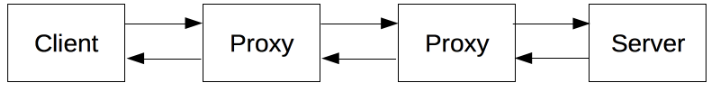
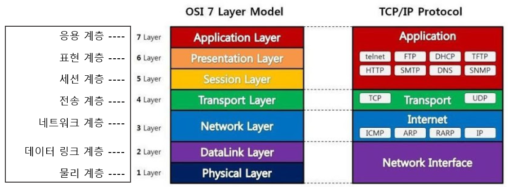
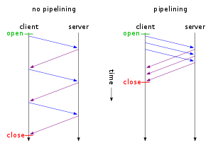

# HTTP

HTTP는 서버로부터 HTML과 같이 하이퍼미디어 리소스들을 가져올 수 있도록 해주는 애플리케이션 레이어 프로토콜이다. 웹에서 모든 데이터를 교환하는 것의 기본이 된다. HTTP는 클라이언트-서버 프로토콜이다. 또한 *무상태 프로토콜*이다. 일반적으로 안정적인 전송 레이어로 *TCP/IP 레이어를 기반으로 사용*한다.

- 클라이언트-서버 모델: 클라이언트가 요청한 다음 응답 받을 때까지 대기하는  것을 말함.
- 무상태 프로토콜: 서버가 두 요청간에 아무 데이터(상태)도 유지하지 않음을 의미한다.

# HTTP 기반 시스템의 구성 요소

- request (클라이언트 → 서버)

  하나의 개체, 사용자 에이전트(또는 그것을 대신하는 프록시)에 의해 전송됨.

  대부분의 경우 사용자 에이전트는 브라우저지만, 검색 엔진 로봇같은 경우도 포함된다.

- response (서버 → 클라이언트)

  개별적인 요청들은 서버로 보내지며, 서버는 요청을 처리하고 response를 제공한다.

- proxy

  응답과 요청 사이에는 여러개의 개체들이 있다. 그 중 하나가 프록시다. 프록시는 게이트웨이 또는 *캐시 역할*을 한다.

실제로 request를 보내는 브라우저와 response를 하는 서버 사이에 여러 단계들(라우터, 모뎀 등)이 더 있다. 웹의 계층적인 설계 덕분에, 이는 네트워크와 전송 계층으로 숨겨진 것이다. 반면 *HTTP는 애플리케이션 계층의 최상위*에 있다.

### 1. 클라이언트: 사용자 에이전트

사용자 에이전트, 말 그대로 사용자를 대신해 동작하는 모든 도구를 말한다. 주로 브라우저가 그 역할을 수행한다. 브라우저는 *항상 요청을 보내기*만한다. 결코 서버가 될 수 없다.

브라우저가 하는 일들은 다음과 같다. HTML, 스크립트 문서, CSS 파일 등의 리소스를 가져오기 위해 서버에 request를 보낸다. → 결과로 받은 문서들을 혼합해서 *웹 페이지*를 생성한다. → 보여준다.

- *웹페이지*: 하이퍼텍스트 문서이다. 하이퍼텍스트가 나타내는 텍스트 중 일부는 사용자가 사용자 에이전트(브라우저)를 제어하고 웹을 돌아다닐 수 있도록 만드는 링크를 포함한다. 브라우저는 HTTP 요청 내에서 이런 지시사항들을 반환하고 HTTP 응답을 해석해 사용자에게 명확한 결과를 표시한다.

### 2. 웹 서버

클라이언트의 요청에 대한 문서를 제공하는 서버가 있다. 서버는 가상적으로 단일한 기계를 나타낸다. (가상적이라고 하는 이유는, 실제로 여러 서버들의 집합일 수 있기 때문이다. 그래서 *"하나의 기계==하나의 서버"라는 말은 옳지 않다*. 하나의 기계에서여러 개의 서버를 띄울 수 있기도 있기 때문.)

### 3. 프록시 (Proxy)

웹 브라우저와 서버 사이에서 수 많은 컴퓨터들과 기계는 HTTP 메세지를 연이어 주고 받는다. 그러나 웹 스택의 계층 구조때문에 대부분의 동작들은 눈에 보이지 않는다. (대부분 네트워크 혹은 물리계층에서 동작하지만, 이는 눈에 보이지 않는다.) 그 많은 동작들 중에서 애플리케이션 레벨에서 동작하는 것을 "프록시"라고 부르는 것이다. 프록시는 다양한 기능들을 수행할 수 있다.

- caching (브라우저의 캐시)
- filtering (바이러스 백신 스캔, 유해 컨텐츠 차단)
- 로드 밸런싱 (여러 서버들이 서로 다른 요청을 처리하도록 허용)
- authentication (다양한 리소스에 대한 접근을 제어함)
- logging (로그 정보를 저장)

# HTTP의 기초적인 측면(aspects)

1. HTTP는 간단하다.

   HTTP는 사람이 읽을 수 있게 간단하게 고안되었다. HTTP 메세지는 사람이 읽고 이해할 수 있으며, 개발자들에게 더 쉬운 테스트 환경을 제공한다. 그래서 초보자에 대한 진입 장벽도 낮춘다.

2. HTTP는 확장성이 좋다.

   HTTP/1.0에서 소개된, HTTP 헤더를 사용하면 더욱 쉽게 확장하고 실험할 수 있다. 클라이언트와 서버의 동의가 그 새로운 헤더의 semantic에 대한 합의만 있다면 얼마든지 새로운 기능을 추가할 수 있다.

3. HTTP는 stateless하다. (sessionless는 아니다.)

   같은 서버에 연속적으로 request를 보내더라도 그 requests는 연관이 없다. 그래서 지속적으로 특정 페이지와 상호작용하려는 사용자들(인터넷 쇼핑 장바구니 등)에게는 문제가 될 수 있다. 이렇게 HTTP의 핵심은 *stateless*지만, HTTP의 쿠키로 *stateful한 세션*을 사용할 수 있다.

   헤더의 확장성을 이용해서, HTTP 쿠키는 각각의 HTTP 요청에 의해 생성된 세션이 동일한 컨텍스트와 동일한 state를 유지할 수 있도록 한다.

4. HTTP 연결

   3번에서도 말했듯 HTTP는 항상 "연결"되어 있지 않다. "연결"이라는 것은 전송계층에서 제어되므로 근본적으로는 HTTP에서 관여하는 부분이 아니다. 그래서 HTTP는 근본적인 전송 프로토콜(TCP나 UDP)을 요구하지 않는다. 단지, 신뢰할 수 있으며 메시지가 유실되지 않는 연결을 요구할 뿐이다. HTTP는 전송 프로토콜 중에서 비교적 신뢰할 수 있는 TCP에 의존한다.

   클라이언트와 서버가 request/response를 주고받기 위해서는 TCP 연결을 해야한다. HTTP/1.0의 기본 동작은  request/response가 있을 때 TCP연결을 여는 것이다. 이때 연속해서 여러 요청을 보내는 경우에는 효율성이 너무 떨어진다. 차라리 TCP 연결을 하나 열어두고 그것을 통해 연결하는 것이 효율적이다. HTTP/1.0에서 TCP연결을 지속하고 싶다면 request헤더와 response헤더에 계속해서 `Connection: keep-alive` 를 추가해줘야만 했다. HTTP/1.1에서는 이 문제를 해결하기 위해서 특별하게 지정하지 않는 한 keep alive가 지속되도록 했다. 그래서 여러개의 request도 동일한 TCP 연결 상에서 보낸다. (다만, 그 길이는 5초에서 15초정도로 매우 짧은 편인데, 이 시간이 너무 길어지면 서버에도 부하가 생기기 때문에 적절히 타협을 본 시간인 것이다.)

   이러한 결함을 개선하기 위해서 HTTP/1.1은 파이프라이닝 개념과 지속적인 연결의 개념을 도입했다. 기본적인 TCP연결은

   

## HTTP의 흐름

클라이언트는 서버와 통신하고자 할 때 다음의 과정들을 거친다.

1. TCP 연결 열기

   TCP 연결을 통해 클라이언트와 서버는 request나 response를 주고받는다. 클라이언트는 새 연결을 열거나, 기존 연결을 재사용하거나 한 서버에 대해 여러 TCP 연결을 열 수 있다.

2. HTTP 메시지를 전송

3. 서버가 보낸 response를 읽는다.

4. 연결을 닫거나 재사용한다.

HTTP 파이프라이닝을 활성화하면, 첫 response를 수신할 때까지 기다리지 않고 여러 request를 보낼 수 있다. HTTP 파이프라이닝은 기존의 네트워크 상에서 구현하기 어렵다는 것이 입증되었기에, 프레임 안에서 보다 활발한 다중 요청을 보내는 HTTP/2.0으로 교체되고 있다.

> HTTP 파이프라이닝
>
> 파이프라이닝은 request와 response가 꼭 순차적으로 이루어지지 않아도 되는 매커니즘이다. HTTP/1.0에서는 연결의 맺고 끊음을 반복했기 때문에 서버 리소스의 비용도 컸다. 그래서 HTTP/1.1에서는 파이프 라이닝 개념을 도입했다. 클라이언트는 각 request에 대한 response를 기다리지 않고, 여러개의 HTTP request들을 하나의 TCP/IP 패킷으로 패킹해서 요청을 보낸다. 즉 하나의 connection을 통해서 다수의 request와 response를 처리할 수 있으며, 네트워크 지연을 줄일 수 있다. 그러나 이 기법은 완전한 멀티플렉싱이 아닌 response 처리를 미루는 방식이므로 각 응답 처리는 순차적으로 처리되며, 결국 후순위의 응답은 지연될 수 밖에 없다. (HTTP/2.0에서는 멀티플렉싱 알고리즘이 등장한다. 그래서 이제 HTTP 파이프라이닝은 최신 브라우저들에서도 기본적으로 활성화되어있지 않다.)

## HTTP 메시지

HTTP/1.1와 초기 HTTP 메시지는 사람이 읽을 수 있었다. 그러나 HTTP/2.0에서는 프레임 안으로 들어가서 헤더의 압축과 다중화같은 최적화를 가능하게 했다. (그래도 HTTP/1.1까지 사용하던 메시지의 포맷을 이해하는 것은 유용하므로 내용을 알아보기로 한다.)

* HTTP Request

  

  * HTTP 메소드 (GET, POST, DELETE 등등)
  * Path (리소스의 경로)
  * HTTP 프로토콜 버전
  * 헤더들 (서버에 추가적인 정보들을 전달하는 역할)

* HTTP Response

  

  * HTTP 프로토콜 버전
  * 상태코드
  * 상태메시지
  * HTTP 헤더
  * (선택사항 - 리소스가 포함되는 본문)

## HTTP 기반의 API

HTTP 기반으로 가장 일반적으로 사용되는 API는 브라우저와 서버 간 데이터를 교환하는 데 사용되는 XMLHttpRequest API다. (최근에는 Fetch API를 훨씬 많이쓰고, Axios와 같은 라이브러리도 많이 사용합니다.)

그 외에도 Server-sent event(서버전송 이벤트) API가 있는데, 서버에서 클라이언트로 이벤트를 보낼 수 있도록 하는 단방향 서비스다. 클라이언트가 서버로 request를 보내지 않아도 서버가 언제든지 새로운 데이터를 보낼 수 있다. 

## 결론

HTTP는 사용하기 쉬운 확장 가능한 프로토콜이다. 클라이언트와 서버간에 헤더도 쉽게 추가할 수 있어 계속해서 발전시킬 수 있다. HTTP/2가 성능 향상을 위해서 HTTP 메시지를 프레임 내로 넣어 약간 복잡해졌을 뿐이지, 애플리케이션 관점에서 볼 때 메시지의 기본적인 구조는 이전과 동일하다. 

다음 편은 캐싱..!