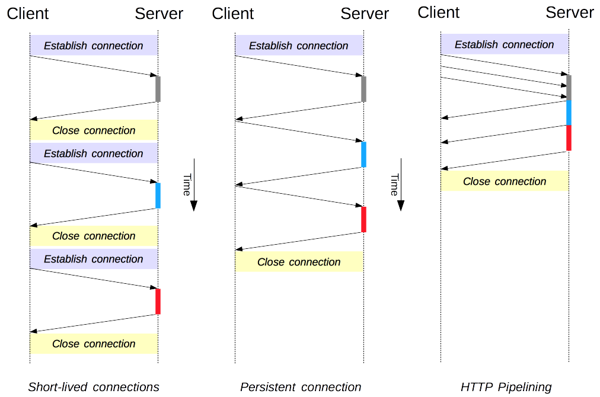
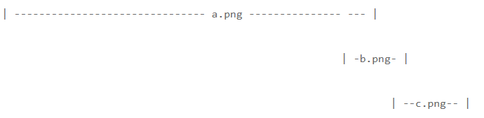
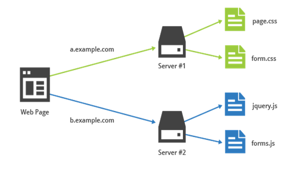
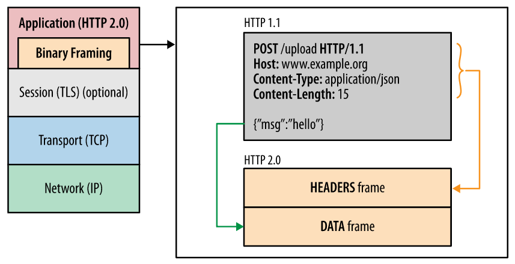
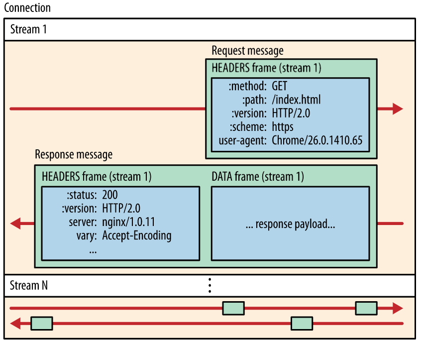
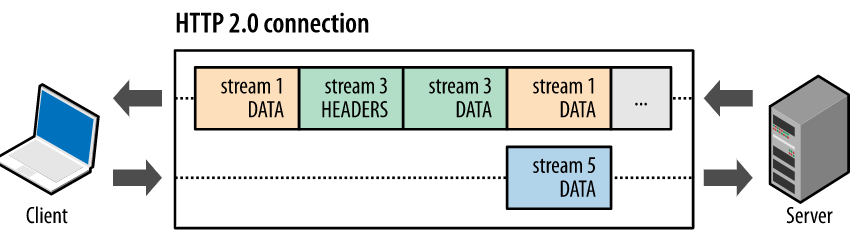

# HTTP의 진화

### **HTTP/0.9**

- http 메소드는 `GET` 밖에 없었음. ex) `GET /mypage.html`
- 응답도 오로지 HTML 파일만 전송될 수 있음. (헤더도 없음.)
- 문제가 생긴 경우에도 파일에 해당 문제 상황에 대한 설명을 적어 보냄.

> 참고 당시에는 HTTP의 버전 번호가 없었다. HTTP 0.9라는 말은 차후 버전과 구별하기 위해 지정한 이름이다.

### **HTTP/1.0**

- 버전 정보가 요청 메세지에 추가됨. (`HTTP/1.0`)
- 상태 코드 라인이 추가됨. (응답 시작부분)
- HTTP 헤더 개념이 요청/ 응답 모두에 도입됨. 메타데이터 전송을 허용하고 프로토콜의 확장성을 높임.
- HTTP 헤더로 인해 HTML 외에 여러가지 파일을 전송할 수 있게 됨. (`Content-Type` 이용)

요청

```
GET /mypage.html HTTP/1.0
User-Agent: NCSA_Mosaic/2.0 (Windows 3.1)
```

응답

```
200 OK
Date: Tue, 15 Nov 1994 08:12:31 GMT
Server: CERN/3.0 libwww/2.17
Content-Type: text/html
<HTML> 
A page with an image
  
</HTML>
```

### HTTP/1.1

- HTTP의 첫 번째 표준 버전임

- 이전 버전들에서 네트워크 레이턴시 문제들이 많아서 이를 해결하기 위해서 두 가지 개념을 도입함.

  

  > 단기 커넥션 HTTP의 본래의 모델이자 HTTP/1.0의 기본 커넥션은 단기 커넥션입니다. 매 요청이 있을 때마다 TCP 핸드셰이크가 발생한다. 따라서 연속해서 요청을 보내면 하나의 TCP를 지속적으로 사용할 때보다 성능이 저하된다. HTTP/1.1 이후로는 단기 커넥션은 잘 사용하지 않음.

  1. **지속적인 커넥션 (Persistant connection)**

     HTTP/1.0에서는 매 요청과 응답마다 TCP연결을 해야했기 때문에 매번 3-way handshake 과정을 거쳐야 했다. 웹 초창기에는 컨텐츠 수가 적어 이러한 요청에 대한 부담이 적었지만, 점차 많아졌기 때문에 매번 이 과정을 반복하는 것은 매우 큰 비용을 요구했음. 그래서 요청 헤더에 `Connection: keep-alive`를 추가했고 TCP 연결이 끊어지지 않도록 직접 설정했다.

     HTTP/1.1에서는 이러한 조건을 추가할 필요없이 모든 요청과 응답이 커넥션을 재사용하도록 설계했다. 그래서 `Connection: close` 라는 명시적인 커넥션 헤더를 추가하지 않는 한 계속해서 커넥션을 재사용한다.

     다만 keep-alive로 설정되어 있더라도 최대 TCP를 유지할 수 있는 기간은 한정적이며 이는 `Keep-Alive` 헤더를 통해 조절할 수 있다.

     ```
     Keep-Alive: timeout=5, max=1000
     ```

     - timeout: 유휴 연결이 계속 열려있어야하는 최소한의 시간(초 단위). (default:0.001)
     - max: 연결이 닫히기 이전에 전송될 수 있는 최대 요청 수 (default: 256)

     > 참고: 지속적인 커넥션의 문제점 지속적인 커넥션을 계속 유지하는 것은 서버에도 부담이 되며, 과부하 상태에서는 Dos 공격을 당할 수도 있다. (연결을 끊지 못하고 계속 서버에서 리소스를 받아와야하므로)

  2. **HTTP 파이프라이닝 (HTTP Pipelining)**

     첫 번째 요청에 대한 응답이 완전히 전송되기 전에 두 번째 요청을 전송할 수 있음.

     HTTP/1.0에서 요청은 소켓에 write한 뒤, 서버의 응답을 받아 다음 요청을 보내는 방식으로 동작함. 여러 요청에 대해 여러 응답을 받고 처리하면 네트워크 레이턴시에 있어 큰 비용을 요구. 게다가 매번 HTTP 요청들은 TCP 연결의 맺고 끊음을 반복하기 때문에 서버 리소스 비용도 커짐.

     HTTP/1.1에서 브라우저는 다수 요청에 대한 응답들을 순차적으로 기다리는 문제를 해결하기 위해, 응답 처리를 미루는 방법을 선택한다. 즉, 클라이언트는 각 요청에 대한 응답을 기다리지 않고, **여러개의 HTTP 요청을 하나의 TCP/IP 패킷에 연속적으로 패킹**해서 요청을 보낸다. => **하나의 커넥션으로 다수의 요청, 응답을 처리하므로 네트워크 레이턴시가 줄어든다**.

     하지만 이 방법 역시 완전한 멀티플렉싱이 아닌 단지 응답처리를 미루는 방식이므로 네트워크 레이턴시를 완벽하게 해결했다고 할 수는 없다. 항상 요청과 응답의 순서가 보장되기 때문에 HOL 블럭킹 문제가 발생할 수 있다.

     > Head Of Line Blocking 아래 그림과 같이 앞 선 파일을 로딩하는 시간이 길어지면 후 순위 작업도 함께 지연되는 현상을 말한다. HTTP/1.1에서는 요청과 응답순서가 동기화되어야하기 때문에 HOL 블러킹이 발생하게 된다. 이 문제는 속도를 매우 늦추기 때문에, 모던 브라우저들은 파이프라이닝을 못하도록 막아두는 경우가 많다. 또한 요청을 보낼 때도 브라우저당 6-8개의 병렬적 커넥션이 가능하므로 이 방법을 사용해서 레이턴시를 낮춘다.

     

     > 파이프라인이 제한되는 경우 파이프라인은 [idempotent](https://www.notion.so/All-About-HTTP-Protocol-60c12a18708b4d168ff110c4efb26364#a1bb2e6194c14102a7f2299070a97f8d) 메서드에서만 사용할 수 있다. (`GET` , `HEAD` , `PUT` , `DELETE` ) 실패한 경우에는 단순히 파이프라인 컨텐츠를 다시 반복하면 되기 때문.

  3. **도메인 샤딩**

     

     브라우저는 각 도메인마다 연결 가능한 커넥션에 대한 개수 제한이 있었음. 그 제한을 넘어 동시에 리소스들을 다운받기 위해서 도메인 샤딩을 사용함.

     도메인 샤딩은 하나의 서버에 대해 여러개의 도메인을 만들어 동시에 동작하는 커넥션의 개수를 늘리려는 기법이다. 그래서 더욱 페이지 로드 시간이 향상되고 사용자 경험이 좋아진다.

     문제점은 다음과 같다.

     - DNS를 찾아보는 비용이 너무 큼
     - TCP 연결 오버헤드가 큼

### SPDY

1997년 HTTP/1.1 버전이 나온 후로 10년 넘게 업데이트되지 않고 있었음. 그 사이 페이지 당 HTTP 요청 개수는 20배 가량 증가했음. 2012년 구글은 로딩 속도와 보안을 모두 잡은 SPDY를 공개함.

<SPDY 공개 당시 웹 페이지 특징>

- 리소스 사용량 급증에 따른 네트워크 레이턴시.
- 다수의 도메인을 사용
- 과거에 비해 동적인 웹페이지
- 보안이 중요한 이슈가 됨.

⇒ 이러한 웹 환경을 고려한 SPDY 프로토콜이 공개됨.

<SPDY의 특징>

- 항상 TLS(Transport Layer Security) 위에서 동작 (HTTPS로 작성된 웹 사이트만 적용 가능)

  전송 계층 보안인 TLS 위에서 동작하기 때문에 보안이 강화됨.

  > TLS(Tansport Layer Security) TCP/IP 네트워크를 사용하는 통신에 적용되며, 통신 과정에서 전송 계층의 종단간 보안과 데이터 무결성을 확보해준다. 두 통신 당사자가 서로 신뢰할 수 있는 자임을 확인해야하며, 서로 통신 내용이 제 3자에 의해 도청되는 것을 방지해야함. 그래서 서로 신뢰할 수 있다는 것을 알리기 위해서 인증서를 사용하며, 도청을 방지하기 위해 통신 내용을 암호화 함.

- HTTP 헤더 압축

  <헤더 압축 등장하게된 배경>

  - 헤더 크기가 점점 커짐(쿠키 .. )
  - 유사하게 반복되는 헤더가 많음
  - API 사용 증가에 따른 작고 빈번한 소통 ↑

  ⇒ HPACK 헤더 압축 알고리즘을 이용해 헤더의 크기를 85~88% 감소. 페이지 로드 시간도 상당히 감소.

- 바이너리 프로토콜

  바이너리 형태로 인코딩하며, 헤더와 데이터 부분을 프레임별로 구분.

  ⇒ 헤더 압축과 멀티플렉싱이 가능해짐.

- 멀티플렉싱

  - 동일한 커넥션 (한 번의 TCP연결) 상에서 다중화 프로토콜 가능해짐.
  - 응답은 요청순서가 아닌 준비되는 순서나 우선순위에 따라 프레임별로 보냄
  - 스트림 우선순위 정할 수 있음.

- Full-duplex interleaving과 스트림 우선순위

  우선순위가 높은 스트림이 우선 순위가 낮은 스트림 앞으로 끼어들어 먼저 갈 수 있음.

  ⇒ HTTP/1.1의 HOL 블럭킹 문제를 어느정도 해결.

- 서버 푸시

⇒ 2009년에 등장한 SPDY는 2012년에는 대부분의 브라우저와 IT 대기업들이 사용하는 사실상 표준이 되어가고 있었음. 뒤늦게 HTTP 공식 그룹에서 SPDY를 교훈삼아 HTTP2를 만들게 되었고, 2012년 시작해서 2015년에 HTTP2가 공식 발표되었다. HTTP2는 SPDY의 좋은 점을 본받고 더 개선한 버전이었기 때문에, 구글에서는 SPDY에 대한 지원을 종료하겠다고 선언했음. 그렇게 SPDY → HTTP2로 옮겨가게 되었다.

### HTTP/2

웹이 점점 발전하고 복잡해지면서 더욱 빠른 속도와 안정성 등을 갖춘 네트워크 프로토콜이 요구됨. 2010년 상반기에 구글은 실험적인 SPDY 프로토콜을 구현했음. 이를 기초로 HTTP/2가 만들어짐.

<HTTP/2 특징>

1. **바이너리 프레임 계층**

   

   - 메시지를 전송할 때 프레임을 사용하게 됨. (이진으로 되어있어 사람이 읽을 수 없음)

   - 이전에는 평문을 사용해서 빈 줄(blank line)로 데이터를 구분했지만, 이제는 헤더(http의 헤더가 아니라 프레임 헤더 정보)와 데이터 부분을 프레임 별로 구분함

   - 프레임으로 구분되어 있기 때문에 헤더도 압축이 가능해짐.

   - 바이너리 형식으로 인코딩 됨.

   - 인코딩 메커니즘이 다르기 때문에 HTTP/1.x와 HTTP/2는 호환이 되지 않음. (그래서 1.2 버전이 아닌 2 버전이 된 것이기도 함)

   - HTTP/2 용어들

     

     1. **스트림(stream)**
        - 구성된 연결 내 전달되는 바이트의 양방향 흐름. 하나 이상의 메시지가 전달될 수 있음.
        - 양방향 스트림 수의 제한은 없다.
        - 각 스트림에는 양방향 메시지 전달에 사용되는 고유한 식별자와 우선순위 정보(optional)가 있다.
     2. **메시지(message)**
        - 프레임의 전체 시퀀스.
        - 각 메시지는 하나의 요청 또는 응답이며, 하나 이상의 프레임으로 구성됨.
     3. **프레임(frame)**
        - HTTP/2 통신의 최소 단위이며 특정 데이터 (헤더, 메시지 페이로드 등)를 전달.
        - 헤더프레임 & 데이터 프레임

2. **요청 및 응답 다중화 (Multiplexing)**

   병렬 요청이 동일한 커넥션상(한 번의 TCP연결 내)에서 이루어질 수 있는 다중화 프로토콜이 사용가능해짐. 응답은 요청 순서가 아닌 응답 준비가 되는 순서대로 보냄. ⇒ HTTP/1.x의 HOL 블럭킹 문제를 어느정도 해결함.

   > HTTP/3 그러나 HTTP/2에서도 HOL 문제를 완전히 해결한 것은 아니며, 이것은 후에 HTTP/3가 등장하는 배경이 된다.

   

   각 프레임 별로 쪼개서 보내며 중간에 다른 프레임이 끼어들어 먼저 전송될 수 있음. 그래서 HTTP/1.1에서 사용된 이미지 스프라이트, 샤딩 등의 임시방편을 사용하지 않아도 됨.

3. **스트림 우선순위 지정**

   - 1~256 사이의 정수 가중치를 할당할 수 있음.
   - 각 스트림은 다른 스트림에 대한 명시적 종속성을 부여할 수 있음.
   - 스트림의 종속성과 가중치는 전송 기본 설정을 표현하는 것 뿐 필수 요구사항은 아니므로 순서가 반드시 보장되는 것은 아님.

4. **한 출처 당 하나의 연결**

   한 출처당 하나의 TCP를 재사용하기 때문에 핸드셰이크가 줄어 클라이언트와 서버 리소스가 감소한다. 또한 바이너리 프레이밍 매커니즘을 사용하기 때문에 병렬로 TCP 연결을 할 필요가 없어짐.

5. **헤더 필드의 압축**

   HTTP/1.x에서 헤더 전송의 문제점들은 다음과 같음.

   - 연속된 요청, 응답은 헤더가 매우 유사한 경우가 많은데 매번 전체 헤더를 주고받는 것에서 리소스가 낭비.
   - 헤더가 매우 유사하게 반복된다는 것을 역이용한 공격(CRIME)에 취약함.

   그래서 HTTP/2.0은 HPACK 헤더 압축방식으로 헤더를 압축하며, 압축방식은 [허프만 인코딩 방식](https://post.naver.com/viewer/postView.nhn?volumeNo=20402243&memberNo=10728965)을 사용함. 결과적으로 불필요한 오버헤드는 제거되고 비용이 감소.

   > HPACK 모든 HTTP/2의 헤더는 HPACK 형태로 인코딩되어 보내짐.

   - 크기가 커진 헤더파일을 허프만 인코딩 방식으로 인코딩함.
   - 매번 전체 헤더를 재전송하기보다 자주 사용되는 헤더들을 인코딩함. 양단(서버, 클라이언트)모두 동적인 헤더테이블을 가지고 있음. 한 쪽에서 다른 쪽으로 헤더를 전송하면 받은 쪽은 해당 정보를 동적테이블에 저장한다. 자주 사용되는 헤더 속성들은 정적 테이블에 정의해둠

6. **서버 푸시**

   클라이언트의 요청 없이 서버→클라이언트로 캐시가능한 리소스를 전송함. 그래서 클라이언트가 다음에 요청할 자원을 예상하고 보낼 수 있음.

   가령 클라이언트가 `index.html` 파일을 요구했는데, 서버는 그 후에 `logo.png` 파일에 대한 요청이 올 것이라는 것을 미리 알고있다면, 클라이언트가 요청하기 전에 미리 보내줄 수 있다. 이렇게하면 불필요한 요청과정을 줄이기 때문에 리소스 절약효과가 있음. (그러나 클라이언트에서 필요하지 않은 리소스를 보낼 경우에는 오히려 리소스 낭비가 발생하고, 이 경우에 클라이언트는 `RST_STREAM` 프레임을 보내 푸시를 취소하라고 요청할 수 있다.)

> **SPDY** 웹 콘텐츠를 전송할 목적으로 구글이 개발한 비표준 개방형 네트워크 프로토콜. 다만 SPDY 자체가 HTTP는 아니고, HTTP가 전송계층을 통해 전송하는 방식을 재정의한 프로토콜이다. 따라서 전송계층의 구현만 변경해 기존 HTTP 서버 프로그램을 그대로 사용할 수 있었음.

특징

- 웹 페이지 부하 레이턴시를 줄임 (압축, 다중화, 우선순위 설정 등을 통해)
- 웹 보안을 개선 (암호화되지 않은 연결을 지원하지 않음)
- 하나의 소켓연결을 통해 여러개의 하위 요소들을 전송하고 받을 수 있음.
- 평문(ASCII) 형태가 아닌 바이너리 형태로 압축되어서 용량이 작음.
- 클라이언트의 요청을 기다리지 않고도 서버 → 클라이언트 전송이 가능함.

> 서버푸시: 전송 요청이 서버에서 시작되는 정보 전달 방식. 폴 기법: 클라이언트 → 서버로 요청 보내는 전달 방식.


출처

- [MDN HTTP 관련 문서](https://developer.mozilla.org/ko/docs/Web/HTTP)
- [Wiki - HTTP](https://ko.wikipedia.org/wiki/HTTP)
- [Wiki - HTTP2](https://ko.wikipedia.org/wiki/HTTP/2)
- [Wiki - SDPY](https://ko.wikipedia.org/wiki/SPDY)
- [구글 웹 개발자 - HTTP2](https://developers.google.com/web/fundamentals/performance/http2?hl=ko)
- [Learning HTTP2 - HTTP2 프레임에 대한 자세한 설명적힌 책](https://www.imel.ba/edukacija/learninghttp2.pdf)
- [SPDY Naver D2](https://d2.naver.com/helloworld/140351)
- [w3.org - HTTP 메소드 설명](https://www.w3.org/Protocols/rfc2616/rfc2616-sec9.html)
- [응답코드 자료](https://www.iana.org/assignments/http-status-codes/http-status-codes.xhtml)
- [http1.1과http2.0속도비교 - golang사이트](https://http1.golang.org/gophertiles?latency=0)
- [HPACK 헤더 압축 알고리즘 공식 문서](https://tools.ietf.org/html/rfc7541)