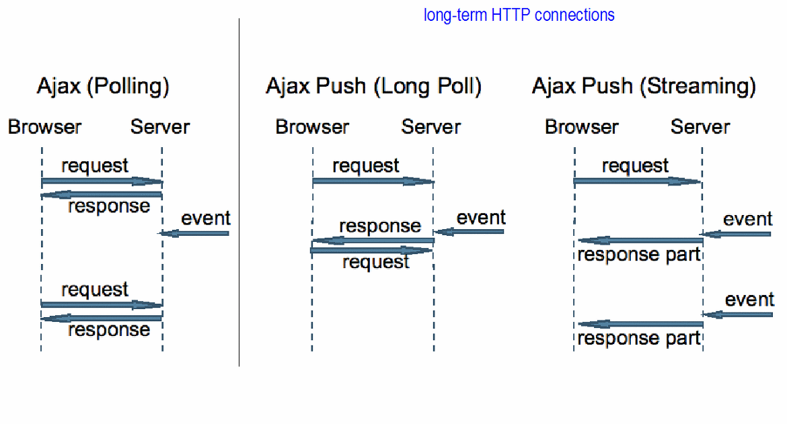

# Long Polling

## Polling이란?

CS에서 polling이란, 클라이언트 프로그램이 외부 기기의 상태를 계속해서 동기적으로 샘플링해오는 것을 의미한다. Polling은 주로 I/O(Input output) 용어를 가리킬 때 사용된다.

- 컴퓨터나 controlling device가 **외부 기기가 준비된 상태인지 체크하기 위해 기다리는 과정**
- 'busy-wait'이라고 부르기도 함. (I/O 동작을 하는 등의 외부 기기가 준비되었다고 허용을 하는 시점까지 컴퓨터는 계속 기다리고 있기 때문이다.)
- 컴퓨터가 **외부 기기가 준비되었는지 계속해서 체크하는 것을 의미**하기도 한다.
- 주로 단순한 하드웨어 기기나 멀티테스크가 되지 않는 OS에서 사용한다.
- 서비스하는 시간보다 폴링하는 시간이 더 길다면 비효율적인 것이다.

⇒ Polling은 외부 기기의 상태가 준비될 때까지 기다리는 과정이며, 기다리면서 계속해서 외부 기기의 상태를 물어보는 일을 한다.

Web이 발전하면서 Polling 기법으로 real time을 처리하는 것은 너무 많은 비효율을 초래했음. 그래서 사람들은 점점 real time에 대한 새로운 http 모델을 필요로 했고, 그 때 등장한 것이 long polling기법이다.

## Long polling

등장 배경

- 폴링으로 데이터를 받아오는 방식은 서버에 매번 새로운 요청을 보내는 것은 너무 많은 자원 낭비. (매번 새로운 커넥션을 만들어야 했기 때문에)

특징

- 데이터를 사용할 수 있게 되거나, threshold에 도달하기 이전까지 **서버가 클라이언트의 커넥션을 가능한 오래 붙잡고 있는 것**이다.

- 주로 서버에서 처리해줘야 한다. 클라이언트는 서버에서 response가 오면 그때 새로운 request를 보내주면 된다.

- 클라이언트는 `Keep-Alive` 헤더에서 timeout 길이를 길게 설정해줄 수 있다. (IETF에 따르면 120초까지 연장하는 것도 성공하긴했지만, 안전성을 위해 30초정도 타임아웃을 주는 것을 권장한다고 함 👉 [참고](https://tools.ietf.org/id/draft-loreto-http-bidirectional-07.html#timeouts))

- 실시간으로 많은 정보를 주고받는 경우에는 롱폴링 대신 웹 소켓 통신 등을 이용하는 것이 좋음.

  

참조

- [ably 사이트의 long polling 개념 설명](https://www.ably.io/concepts/long-polling)
- [IETF 문서 - Known Issues and Best Practices for the Use of Long Polling and Streaming in Bidirectional HTTP](https://tools.ietf.org/id/draft-loreto-http-bidirectional-07.html)