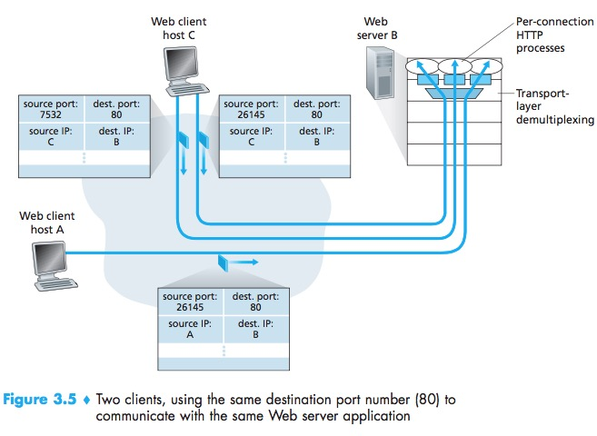

# UDP (User Datagram Protocol)
>* 프로세스 대 프로세스 데이터 전달, 오류 검출 서비스, 다중화/역다중화 서비스만 제공한다. (속도가 빠름)   
>* 하나의 프로세스에 의해서 전송된 데이터의 일부 혹은 전부가 손상되지 않고 목적지 프로세스에 도착한다는 것을 보장하지 않는다. (비 신뢰성)   
>* 송신 전송 계층 개체들과 수신 전송 계층 개체들 사이에 핸드셰이크를 사용하지 않는다. (비 연결성)

## TCP보다 UDP가 적합한 이유
1. 어플리케이션 레벨에서 정교하게 데이터를 제어하는 경우.
    - 지나치게 지연되는 세그먼트 전송을 원하지 않는 경우.
    - 조금의 데이터 손실은 허용하는 경우.
    - 최소 전송률을 요구하는 경우.   
    => TCP의 신뢰성과 혼잡제어 정책이 필요하지 않는 경우에 UDP를 사용한다.

2. 연결 설정이 없다.
    - UDP는 형식적인 예비동작 (TCP의 Handshake)없이 데이터를 전송한다. 그러므로 연결을 설정하기 위해 소요되는 시간이 없다.    

3. 연결 상태가 없다.
    - UDP는 연결을 유지하기 위해 유지하는 것이 없다. 그래서 TCP보다 좀 더 많은 클라이언트를 수용할 수 있다.
        - TCP는 연결 상태를 유지하기 위해 송신 버퍼, 수신 버퍼, 혼잡제어 파라미터, 순서 번호, 확인 번호 파라미터를 기록한다.

4. 작은 패킷 오버헤드.
    - UDP는 세그먼트마다 8바이트의 헤드를 갖는다.
        - TCP는 20바이트다.

## UDP Header
                  0      7 8     15 16    23 24    31
                 +--------+--------+--------+--------+
                 |     Source      |   Destination   |
                 |      Port       |      Port       |
                 +--------+--------+--------+--------+
                 |                 |                 |
                 |     Length      |    Checksum     |
                 +--------+--------+--------+--------+
                 |
                 |          data octets ...
                 +---------------- ...   

 [출처] RFC768 : https://tools.ietf.org/html/rfc768

* **Checksum** : 세그먼트가 출발지로부터 목적지로 이동 했을 때 세그먼트 안의 데이터에 변경사항이 있는지 검사하는 것이다. (오류 검출)
    * 세그먼트의 데이터를 16비트 워드 단위로 더하고 이에 대하여 1의 보수를 수행한다. 덧셈 과정에서 발생하는 오버플로우는 '윤회식 자리올림(Wrap around)' 한다.
    > 1의 보수 : 모든 0을 1로 변환하고 모든 1을 0으로 변환한다.   
    > 윤회식 자리올림 : 올림된 값이 범위를 넘어가는 경우 1의 자리에 올림된 값을 더해준다.

    > [예시] 다음과 같은 3개의 16비트 워드가 있다고 가정하자.   
        0110011001100000   
        0101010101010101   
        1000111100001100   
    1. 처음 2개의 워드 합을 구한다.
    > 0110011001100000   
    0101010101010101    
    1011101110110101 <- 결과
    2. 위 계산 합에 세번째 워드를 더한다.
    >   1011101110110101   
      1000111100001100   
    (1)0100101011000001 -> 0100101011000010 -> 1011010100111101 (checksum)
    3. 연산 결과로 얻은 값을 checksum에 넣어준다.
    4. 수신측은 3개의 16비트 워드와 체크섬을 더해준다. 더한 결과가 1111111111111111이 나왔으면 데이터에 어떤 오류도 있지 않다는 것 이다. (1의 보수 연산을 해줬기 때문에 111~이 가능하다.)
    * UDP가 체크섬을 제공하는 이유는 출발지와 목적지 사이의 모든 링크가 오류 검사를 제공한다는 보장이 없기 때문이다.

## UDP의 패킷 송수신 방법 (데이터 그램 패킷 교환 방법)
> * 목적지가 같은 패킷이라도 따로 전송하는 방법이다. 그러므로 패킷마다 가는 경로가 다를 수 있고, 망 상황에 따라서 경로가 달라진다.
> * UDP환경에서 패킷의 도착 순서를 보장할 수 없는 이유가 이때문이다.   

# TCP vs UDP
|프로토콜|TCP|UDP
|--|--|--|
|연결성|연결형|비연결형|
|신뢰성| 높음|낮음|
|속도|느림|빠름|
|패킷 교환 방식| 가상 회선 방식 | 데이터그램 방식|
|재전송 | O|X|
|통신 방식 | 1:1 | 1:1,1:N,N:N|
|용도|신뢰성 요구 작업|실시간 전송 작업|

# 전송계층에서 다중화 (Multiplexing) 와 역다중화(Demultiplexing)
> * TCP/UDP는 OSI 7계층 중 전송 계층에 속하는 프로토콜이다. 
> * 상위 계층에서 받은 각 데이터에 헤더 정보로 캡슐화하고, 그 세그먼트들을 네트워크 계층에 전달하는 작업을 **다중화** 라고 한다.
> * 네트워크 계층에서 전송 계층으로 수신한 세그먼트를 전달하는 것을 **역다중화**라고 한다.

* TCP 프로토콜을 이용한 소켓 식별은 **출발지 포트번호, 출발지 IP주소, 목적지 포트 번호, 목적지 IP주소**에 의해 식별된다.
* UDP 프로토콜을 이용한 소켓 식별은 **목적지 IP주소, 목적지 포트 번호**로 식별된다.   

## 전송 계층 다중화의 요구사항.
1. 소켓은 유일한 식별자를 가져야한다.
2. 각 세그먼트는 세그먼트가 전달될 적절한 소켓을 가리키는 특별한 필드(Source port, Destination port)를 가진다.

### **[출처]**
* Pearson, COMPUTER NETWORKING A TOP-DOWN APPROACH 7th, 최종원 외 5명,James F. Kurose 외 1명
* 시나공 정보처리기사 2020 실기
* https://woovictory.github.io/2018/12/28/Network-Packet-Switching-Method/
