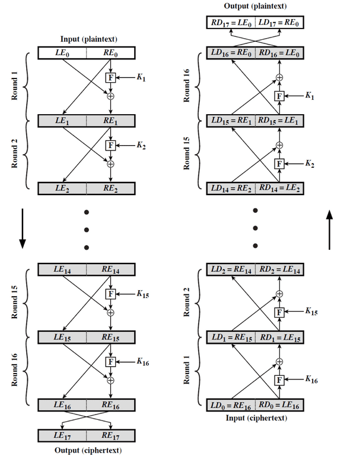
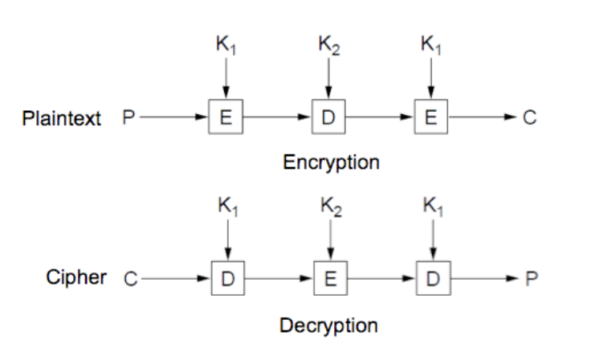
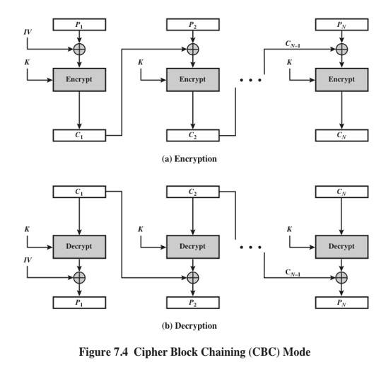

# 대칭키와 비대칭키

  

### Symmetric encryption (대칭 암호화 기법)

1개의 키를 이용해 암/복호화 하는 암호화 기법

메세지, 파일, 암호화 키, 비밀번호 같은 다양한 크기의 블록 / 스트림 데이터를 암호화 하는데 사용한다.

* 송신자와 수신자가 같은 키를 사용해서 키를 주고받는 경우 제3자에게 키가 노출될 위험이 있다.

  

**대표 기법**

	DES, 3DES, AES, CBC, RC4

* #### Feistel Cipher 
```
Block cipher의 기본이 되는 암호화 기법, 특정 계산 함수 Function을 실행하는 단위를 Round로 칭하고 암/복호화에 16라운드의 과정을 거친다.
1. 서브키 K1, K2... Kn은 키 K를 가지고 Subkey generation algorithm을 이용해 생성한다.
2. Plain text를 2개로 나눠서 처리한다.
3. 블록과 키의 크기는 클수록 좋지만 그러면 암/복호화 속도가 떨어진다. 평균적으로 64bit를 이용.
```
[Feistel Encryption and Decrpytion (16round)]   
</img>   
** Encrpytion부분 swap부분이 RE17, LE17이 되어야함.**   

* #### DES (Data Encryption Standard)   
	```
	Feistel cipher를 사용하는 암호화 기법 중 하나이다.
	64비트의 블록 사이즈와 56비트의 키를 갖는다. -> DES의 유일한 취약점
	56비트의 키를 같는 이유는 총 64비트의 사이즈에서 8바이트는 패리티 비트기 때문.
	```
* #### 3DES (Triple-DES)
	```
	DES의 취약점인 키 사이즈가 작은 것을 보완해주기 위해서 나온 암호화 기법이다.
	3 DES는 DES Encrpytion,Decrytion을 2번 더 해준다. Key size : 56 -> 112bits
	아래 그림을 보면 암호화는 EDE, 복호화는 DED순서로 간다. 그 이유는 암,복호화중 한 곳에서 3DES를 지원하지 않을 경우 DES만으로도 암,복호화가 가능하게끔 확장성을 보장하기 위해서다.
	```
	</img>   
* #### AES (Advanced Encryption Standard)
```
현재 표준으로 사용되는 암호화 기법이다. DES와는 다르게 Feistel cipher를 사용하지 않는다.
Block size : 128 or 256bit, Key size : 128 or 256bit, Round : 10 or 14 Round
블록 사이즈와 키 사이즈는 동일하며 라운드 횟수는 블록/키 사이즈에 따라 달라진다.

[AES 4단계 : Bytesub -> Shift row -> Mix column -> Add round key]
	1. Bytesub : S-box라는 표를 이용해 바이트 단위로 블록을 치환한다.
	2. Shift row : 단순히 행과 행을 치환한다.
	3. Mix column : 순환 행렬을 사용해 함수로 열에 있는 각 바이트를 대체하여 변화시킨다.
	4. Add round key : 확장된 키의 일부화 현재 블록을 XOR 연산한다.
```   

* #### CBC (Cipher Block Chaining)
```
개의 키로 여러블록을 암호화한다. Pi와 Ci-1을 XOR한 후 암호화 한다.
공격자가 Ci를 조작했다면 복호화 했을 때 Ci가 마지막 블록인 경우 1개, 아닌경우 2개의 블록이 영향을 받는다.
```
</img>
* #### RC4 (Cipher Block Chaining)
```
RSA보안을 위해서 등장했으며, SSL/TLS에 적용된다.
랜덤 순열 기반으로 작동하며 SW환경에서 동작이 빠르다.
단점으로는 Key생성에 문제가 있다. (랜덤한 Seed를 사용해서 Key를 생성해야하지만 랜덤한 Seed라는 것이 불확실적임.)
```


### Asymmetric encryption (비대칭 암호화 기법)

2개의 키를 이용해 암/복호화 하는 암호화 기법

작은 블록 데이터, 암호화 키, 해싱된 데이터 같은 디지털 서명에 사용되는 데이터를 암호화한다.

  

* 우리가 알고있는 공인인증서가 비대칭 기법에 해당된다.

  

**대표 기법**
	
	RSA 알고리즘 (공개키 암호화 방식)

* #### RSA 
```
공개키 암호시스템 중 하나로 암호화 뿐만 아니라 전자서명이 가능한 암호화 기법이다.
RSA 암호화 기법은 2개의 키를 사용한다. 하나는 PU(공개 키)이며 다른 하나느 PR(개인 키)이다.
자신의 공개키는 널리 퍼지면 퍼질 수록 이득이 된다. PU로 암호화 한 데이터는 PR로만 풀어낼 수 있다.

(PU/PR로 암호화하면 복호화는 PR/PU를 이용해 복호화해야한다. 이에 대한 증명은 오일러 정리를 사용하기 때문에 넘어간다.)

A -> B에게 암호화한 데이터를 전송하는 경우!
Plain text -> E(PRa, Plain text) = Ea -> E(PUb, Ea) = Eb -> Send
	: A의 개인키로 1차 암호화를 한 다음 수신자의 공개키로 2차 암호화를 한 뒤 전송한다.

디지털 서명에는 PR키를 사용한다.
패킷을 받는 측은 A의 PU를 갖고있기 때문에 서명된 데이터가 A의 PU로 복호화할 수 있음을 이용한 방법이다.
```
* #### Diffie-Hellman Key Exchange 
```
암호 키를 교환하는 하나의 방법으로, 두 사람이 암호화되지 않은 통신을 이용해 공통의 비밀 키를 공유할 수 있도록 해준다.
```

### Data integrity algorithm

수신받은 데이터가 변경되었는지 확인하는데 사용하는 알고리즘이다. 현실적으로 어디가 변경되었는지를 확인하는데 어려움이 있어서 데이터 변조가 되었는지만 체크하는 방법으로 사용한다.


**대표 기법**

	SHA

* #### SHA (Secure Hash Algorithm)
```
안전한 해시 알고리즘 함수들은 암호학적 해시 함수들의 모임이다. 
데이터 암호화를 하는데 사용하지 않고 데이터의 무결성을 검증하는데 많이 사용한다.
SHA - 224, 256, 384, 512를 통칭해 SHA-2라고 부른다.
SHA 뒤의 숫자는 해시값의 크기를 의미한다.
```

[출처]   
위키백과   
『Crpytograph and Network Security』 - William Stallings